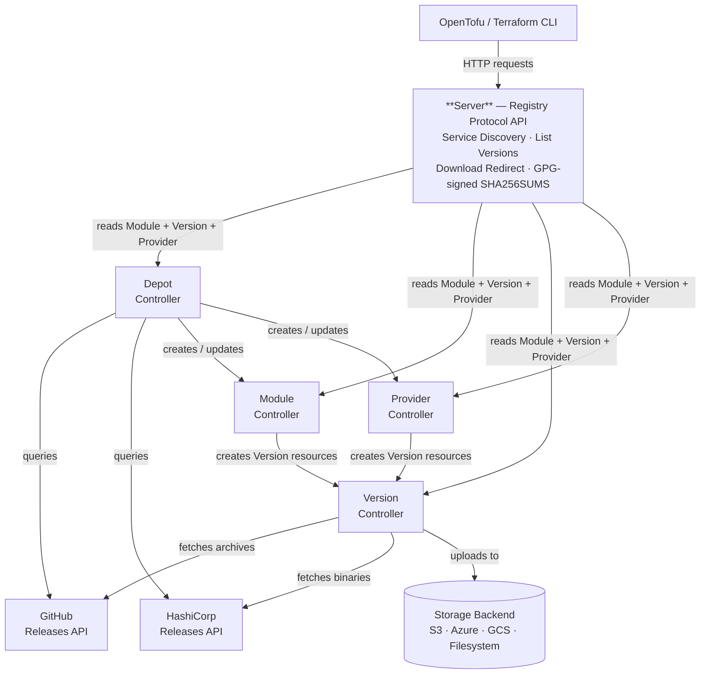

# OpenDepot

[](https://go.dev/)
[](https://github.com/tonedefdev/opendepot/blob/main/LICENSE)
[](https://github.com/tonedefdev/opendepot/tree/main/chart/opendepot)

<p align="center">
  
</p>

A Kubernetes-native, self-hosted OpenTofu/Terraform module and provider registry that implements both the [Module Registry Protocol](https://opentofu.org/docs/internals/module-registry-protocol/) and the [Provider Registry Protocol](https://developer.hashicorp.com/terraform/internals/provider-registry-protocol). OpenDepot gives organizations complete control over distribution, versioning, and storage — without relying on the public registry.

Compatible with **OpenTofu** (all versions) and **Terraform** (v1.2+).

## Table of Contents

- [Why OpenDepot?](#why-opendepot)
- [How It Works](#how-it-works)
- [Architecture](#architecture)
- [Services](#services)
- [Storage Backends](#storage-backends)
- [Getting Started](#getting-started)
- [Local Testing with kind](#local-testing-with-kind)
- [Configuration](#configuration)
  - [GPG Signing for Providers](#gpg-signing-for-providers)
- [Usage](#usage)
  - [Consuming Providers](#consuming-providers)
- [Migrating to OpenDepot](#migrating-to-opendepot)
- [Authenticating with OpenDepot](#authenticating-with-opendepot)
- [Kubernetes RBAC](#kubernetes-rbac)
- [API Reference](#api-reference)
- [Internal Developer Portal Example](#internal-developer-portal-example)
- [Version Constraints](#version-constraints)
- [Project Structure](#project-structure)
- [License](#license)

## Why OpenDepot?

There are several open-source Terraform/OpenTofu module registries. They're good projects, but they all share a common challenge: **authentication and authorization are bolted on**. Most require you to stand up a separate database, configure API keys or OAuth flows, and manage user accounts outside of your infrastructure platform.

OpenDepot takes a fundamentally different approach. Instead of reinventing auth, it delegates it entirely to Kubernetes — the platform you're likely already running!

### Security First

| Capability | OpenDepot | Traditional Registries |
|-----------|----------|------------------------|
| **Authentication** | Kubernetes bearer tokens or kubeconfig — no proprietary tokens, no user database | API keys, OAuth, or basic auth requiring a separate identity store |
| **Authorization** | Kubernetes RBAC — namespace-scoped roles control who can read, publish, or admin modules | Custom permission models, often coarse-grained or application-level only |
| **Token Lifecycle** | Short-lived, auto-rotating tokens via `aws eks get-token`, `gcloud auth`, or `az account get-access-token` | Long-lived API keys that must be manually rotated |
| **Audit Trail** | Kubernetes audit logs capture every API call with user identity, verb, and resource | Varies — often requires additional logging configuration |
| **Zero Additional Infrastructure** | No database, no Redis, no external IdP integration | Typically requires PostgreSQL, MySQL, or SQLite plus session management |

Because OpenDepot uses Kubernetes ServiceAccounts and RBAC natively, your existing identity federation (IRSA on EKS, Workload Identity on GKE/AKS, or any OIDC provider) works out of the box. There's nothing extra to configure — if a user or CI pipeline can authenticate to your cluster, they can authenticate to OpenDepot.

### Desired State Reconciliation

Traditional registries are imperative: you push a module or provider version via an API call, and the registry stores it. If something goes wrong — a failed upload, a corrupted archive, a storage outage — you have to detect and remediate it yourself.

OpenDepot is **declarative**. You describe the modules/providers and versions you want, and Kubernetes controllers continuously reconcile toward that desired state:

- **Self-healing:** If a Version resource fails to sync, the controller retries with exponential backoff. Transient GitHub, network, or storage errors resolve automatically.
- **Idempotent:** Applying the same Module/Provider manifest twice is a no-op. Controllers only act on drift.
- **Garbage collection:** Remove a version from `spec.versions` and the controller cleans up the Version resource and its storage artifact.
- **Immutability enforcement:** When `immutable: true` is set, the controller validates checksums on every reconciliation — not just at upload time.

This is the same operational model that makes Kubernetes itself reliable, applied to your OpenTofu registry.

### Tamper-Resistant Checksums

Most registries compute a checksum when a module is uploaded and verify it on download — but that single point of validation leaves a window for tampering. If someone replaces the artifact in storage, the registry has no way to detect the change.

OpenDepot takes a stronger approach. When a Version controller first discovers a module artifact, it computes the checksum and writes it to the Version resource's **`.status`** field. Kubernetes exposes status as a separate subresource (`versions/status`), and OpenDepot's RBAC only grants write access to the Version controller's ServiceAccount — users, CI pipelines, and `kubectl edit` cannot modify it unless explicitly given access to it. On every subsequent reconciliation, the controller compares the storage artifact's checksum against this recorded status value. If the checksums diverge, the controller flags the version as tampered and refuses to serve it.

This means an attacker who gains write access to your storage backend still can't silently swap a module archive. The checksum of record lives in the Kubernetes API, is protected by Kubernetes RBAC, and is verified continuously — not just once at upload time.

### How OpenDepot Compares

| Feature | OpenDepot | Terrareg | Tapir |
|---------|----------|----------|-------|
| Auth mechanism | Kubernetes RBAC + bearer tokens | API keys + SAML/OpenID Connect | API keys |
| Database required | No (Kubernetes API is the datastore) | Yes (PostgreSQL/MySQL/SQLite) | Yes (MongoDB/PostgreSQL) |
| Deployment model | Helm chart, runs on any Kubernetes cluster | Docker Compose or standalone | Docker Compose or standalone |
| Self-healing | Yes (controller reconciliation loop) | No | No |
| Multi-cloud storage | S3, Azure Blob, GCS, Filesystem | S3, Filesystem | S3, GCS, Filesystem |
| Version discovery | Automatic via Depot (GitHub Releases API for modules, HashiCorp Releases API for providers) | Manual upload or API push | Manual upload or API push |
| Immutability enforcement | Checksum validated every reconciliation | At upload time only | At upload time only |
| Air-gapped support | Yes (filesystem backend + PVC) | Yes (filesystem) | Limited |

> [!TIP]
> If you're already running Kubernetes, OpenDepot gives you a registry where security, auth, and operations come free — no extra infrastructure, no extra accounts, no extra attack surface.

## How It Works

When you reference a module in your OpenTofu configuration:

```hcl
module "eks" {
  source  = "opendepot.defdev.io/opendepot-system/terraform-aws-eks/aws"
  version = "~> 21.0"
}
```

OpenTofu uses the Module Registry Protocol to:

1. **Discover** the registry API via `/.well-known/terraform.json`
2. **List versions** matching your constraint (`~> 21.0`)
3. **Download** the module archive from the configured storage backend

When you reference a provider in your OpenTofu configuration:

```hcl
terraform {
  required_providers {
    aws = {
      source  = "opendepot.defdev.io/opendepot-system/aws"
      version = "~> 6.0"
    }
  }
}
```

OpenTofu uses the Provider Registry Protocol to:

1. **Discover** provider versions and supported platforms
2. **Request** package metadata for the selected version, OS, and architecture
3. **Download and verify** the provider archive using `SHA256SUMS` and `SHA256SUMS.sig`

OpenDepot implements all required protocol endpoints, making it a drop-in replacement for any public or private module and provider registry.

## Architecture

OpenDepot consists of four services running in Kubernetes:



### Event Flow

1. **Depot controller** watches `Depot` resources, queries the GitHub Releases API for modules matching version constraints, queries the HashiCorp Releases API for providers matching version constraints, and creates or updates `Module` and `Provider` resources
2. **Module controller** watches `Module` resources, creates a `Version` resource for each version listed in `spec.versions`, generates unique filenames, and tracks the latest version
3. **Provider controller** watches `Provider` resources, creates a `Version` resource for each version and OS/architecture combination in `spec.versions`, and tracks the latest version
4. **Version controller** watches `Version` resources, fetches module source from GitHub or provider binaries from the HashiCorp Releases API, computes SHA256 checksums, generates GPG signatures (for providers), and uploads archives to the configured storage backend
5. **Server** handles OpenTofu/Terraform requests, queries Kubernetes for `Module`, `Provider`, and `Version` resources, and redirects downloads to the storage backend

## Services

### Version Controller (Core)

The most critical component. It performs the actual work of fetching module and provider artifacts and uploading them to storage.

**Reconciliation loop (modules):**

1. Fetches the module source from GitHub at the specified version/tag
2. Packages the source into a distribution archive (`.tar.gz` or `.zip`)
3. Generates a UUID7 filename for the archive (via `spec.fileName`, set by the Module controller on creation)
4. Computes a base64-encoded SHA256 checksum
5. Uploads the archive to the configured storage backend
6. Updates the `Version` resource status with the checksum and sync state

**Reconciliation loop (providers):**

1. Queries the HashiCorp Releases API for the provider binary matching the target OS/architecture
2. Downloads the provider archive (`.zip`)
3. Generates a UUID7 filename and persists it to `spec.fileName` on the `Version` resource — subsequent reconciliations reuse the same filename, preventing duplicate uploads
4. Computes a SHA256 checksum and generates a detached GPG signature over the `SHA256SUMS` file
5. Uploads the archive to the configured storage backend
6. Updates the `Version` resource status with the sync state

**Unpredictable filenames:** Both module and provider archives are stored with UUID7-generated filenames (e.g., `019726b3-1a2b-7c3d-8e4f-5a6b7c8d9e0f.zip`) instead of the original source filename. This prevents enumeration of storage objects by unauthenticated clients — the download URL cannot be guessed without first authenticating to the registry API and retrieving the `Version` resource.

**Immutability:** When `immutable: true` is set in the module config, the Version controller enforces that the stored checksum always matches the archive checksum. This prevents any modification or replacement of a published version.

### Module Controller

Orchestrates version lifecycle management. For each version in `Module.spec.versions`, the Module controller:

- Creates a corresponding `Version` resource with the module configuration
- Generates a UUID7 filename with the appropriate extension (`.zip` or `.tar.gz`)
- Tracks the latest version using semantic version sorting
- Garbage-collects orphaned `Version` resources when versions are removed
- Enforces `versionHistoryLimit` when configured

### Provider Controller

Orchestrates provider version lifecycle management. For each version in `Provider.spec.versions`, the Provider controller creates a `Version` resource for every OS/architecture combination defined in `spec.providerConfig.operatingSystems` and `spec.providerConfig.architectures`. For example, a single `Provider` with one version, two operating systems (`linux`, `darwin`), and two architectures (`amd64`, `arm64`) will produce four `Version` resources.

The Provider controller:

- Creates `Version` resources for each version × OS × architecture combination
- Tracks the latest version using semantic version sorting
- Garbage-collects orphaned `Version` resources when versions are removed
- Enforces `versionHistoryLimit` when configured
- Labels each `Version` with `opendepot.defdev.io/provider=<name>` for easy filtering

**Example Provider resource:**

```yaml
apiVersion: opendepot.defdev.io/v1alpha1
kind: Provider
metadata:
  name: aws
  namespace: opendepot-system
spec:
  providerConfig:
    name: aws
    operatingSystems:
      - linux
      - darwin
    architectures:
      - amd64
      - arm64
    storageConfig:
      s3:
        bucket: opendepot-providers
        region: us-west-2
  versions:
    - version: "5.80.0"
    - version: "5.81.0"
```

This produces eight `Version` resources (`5.80.0-linux-amd64`, `5.80.0-linux-arm64`, `5.80.0-darwin-amd64`, `5.80.0-darwin-arm64`, and the same four for `5.81.0`). The Version controller then fetches each binary from the HashiCorp Releases API and stores it in S3 under a UUID7 filename.

### Depot Controller

Automates module and provider discovery. The Depot controller:

- Queries the **GitHub Releases API** for each entry in `spec.moduleConfigs`, resolves version constraints, and creates or updates `Module` resources
- Queries the **HashiCorp Releases API** for each entry in `spec.providerConfigs`, resolves version constraints, and creates or updates `Provider` resources
- Supports configurable polling intervals (`pollingIntervalMinutes`)
- Inherits `global` config (storage, GitHub auth, file format) to each module unless overridden
- Updates `status.modules` and `status.providers` with the names of all managed resources
- Serves as a **migration bridge** — import modules and providers in bulk, then delete the Depot once you transition to CI/CD-driven publishing

### Server

Implements both the Module Registry Protocol and the Provider Registry Protocol as an HTTP API. The server authenticates requests using either Kubernetes bearer tokens or base64-encoded kubeconfigs, then queries the Kubernetes API for module, provider, and version data.

Provider artifact endpoints (binary download, `SHA256SUMS`, `SHA256SUMS.sig`) are served using the server's own ServiceAccount per the [Terraform Provider Registry Protocol](https://developer.hashicorp.com/terraform/internals/provider-registry-protocol) — OpenTofu fetches these URLs without forwarding client credentials, so authentication is provided at the metadata tier rather than the artifact tier.
> [!IMPORTANT]
> To prevent unauthenticated users from easily enumerating provider artifacts, provider files are stored with UUID7-based filenames.

## Storage Backends

OpenDepot supports four storage backends. Each is configured via the `storageConfig` field on `Depot.spec.global.storageConfig`, `ModuleConfig.storageConfig`, or directly on a `Module.spec.moduleConfig.storageConfig`.

### Amazon S3

**Recommended for production.** Stores module archives in S3 buckets with SHA256 checksum validation.

**CRD Fields:**

| Field | Type | Required | Description |
|-------|------|----------|-------------|
| `bucket` | string | Yes | S3 bucket name |
| `region` | string | Yes | AWS region (e.g., `us-west-2`) |
| `key` | string | No | Bucket key prefix (auto-generated by the Module controller) |

**Authentication:** Uses the [AWS SDK v2 default credentials chain](https://docs.aws.amazon.com/sdk-for-go/v2/developer-guide/configure-gosdk.html). In Kubernetes, this typically means:

- **EKS with IRSA** (recommended): Annotate the Version controller's ServiceAccount with an IAM role ARN
- **Environment variables**: Set `AWS_ACCESS_KEY_ID`, `AWS_SECRET_ACCESS_KEY`, and optionally `AWS_SESSION_TOKEN`
- **EC2 instance profile**: Automatically used when running on EC2/EKS nodes

**Required IAM Permissions:**

```json
{
  "Effect": "Allow",
  "Action": [
    "s3:GetObject",
    "s3:PutObject",
    "s3:DeleteObject",
    "s3:GetObjectAttributes"
  ],
  "Resource": "arn:aws:s3:::your-bucket-name/*"
}
```

**Example Configuration:**

```yaml
storageConfig:
  s3:
    bucket: opendepot-modules
    region: us-west-2
```

### Azure Blob Storage

**Recommended for production.** Stores module archives in Azure Blob Storage containers with checksum metadata.

**CRD Fields:**

| Field | Type | Required | Description |
|-------|------|----------|-------------|
| `accountName` | string | Yes | Azure Storage Account name |
| `accountUrl` | string | Yes | Storage Account URL (e.g., `https://myaccount.blob.core.windows.net`) |
| `subscriptionID` | string | Yes | Azure subscription ID |
| `resourceGroup` | string | Yes | Resource Group containing the Storage Account |

**Authentication:** Uses [Azure DefaultAzureCredential](https://learn.microsoft.com/en-us/azure/developer/go/azure-sdk-authentication). In Kubernetes, this typically means:

- **AKS with Workload Identity** (recommended): Configure federated identity credentials on the Version controller's ServiceAccount
- **Managed Identity**: Assign a managed identity to the AKS node pool or pod
- **Environment variables**: Set `AZURE_CLIENT_ID`, `AZURE_TENANT_ID`, and `AZURE_CLIENT_SECRET`

**Required Azure RBAC Roles:**

- `Storage Blob Data Contributor` on the Storage Account (for read, write, and delete)
- `Reader` on the Storage Account resource (for container metadata operations)

**Example Configuration:**

```yaml
storageConfig:
  azureStorage:
    accountName: opendepotmodules
    accountUrl: https://opendepotmodules.blob.core.windows.net
    subscriptionID: 00000000-0000-0000-0000-000000000000
    resourceGroup: opendepot-rg
```

### Google Cloud Storage

**CRD Fields:**

| Field | Type | Required | Description |
|-------|------|----------|-------------|
| `bucket` | string | Yes | GCS bucket name |

**Authentication:** Uses [Application Default Credentials (ADC)](https://cloud.google.com/docs/authentication/application-default-credentials). In Kubernetes, this typically means:

- **GKE with Workload Identity** (recommended): Bind a Google service account to the Version controller's Kubernetes ServiceAccount
- **Service account key**: Mount a JSON key file and set `GOOGLE_APPLICATION_CREDENTIALS`

**Required GCS Permissions:**

- `storage.objects.create`
- `storage.objects.get`
- `storage.objects.delete`
- `storage.objects.getMetadata` (or the `Storage Object Admin` role)

**Example Configuration:**

```yaml
storageConfig:
  gcs:
    bucket: opendepot-modules
```

### Local Filesystem

Stores module archives on a shared volume mounted to both the Version controller and the Server pods. Suitable for **development, testing, and air-gapped environments** when paired with a `PersistentVolumeClaim`.

**CRD Fields:**

| Field | Type | Required | Description |
|-------|------|----------|-------------|
| `directoryPath` | string | No | Directory path where modules are stored (must match the container mount path) |

**How it works:** The Helm chart creates a shared volume (either a `PersistentVolumeClaim` or a `hostPath`) and mounts it to both the Version controller and the Server. The Version controller writes module archives to the volume, and the Server reads and serves them.

**Helm Storage Configuration:**

| Value | Default | Description |
|-------|---------|-------------|
| `storage.filesystem.enabled` | `false` | Enable shared volume for filesystem storage |
| `storage.filesystem.mountPath` | `/data/modules` | Mount path inside containers |
| `storage.filesystem.hostPath` | `""` | Use a hostPath volume (for local dev with kind) |
| `storage.filesystem.storageClassName` | `""` | StorageClass for the PVC (must support `ReadWriteMany`) |
| `storage.filesystem.size` | `10Gi` | PVC size |

> [!NOTE]
> Set `directoryPath` in your CRD to match the `storage.filesystem.mountPath` Helm value (default `/data/modules`).

**Local Development with kind (hostPath):**

```bash
helm upgrade --install opendepot chart/opendepot \
  -n opendepot-system \
  --create-namespace \
  --set storage.filesystem.enabled=true \
  --set storage.filesystem.hostPath=/tmp/opendepot-modules
```

When using `hostPath`, the chart adds an `initContainer` that runs as root to set ownership of the volume to uid `65532` (the non-root user the containers run as).

**Production with PVC (ReadWriteMany):**

```bash
helm upgrade --install opendepot chart/opendepot \
  -n opendepot-system \
  --create-namespace \
  --set storage.filesystem.enabled=true \
  --set storage.filesystem.storageClassName=efs-sc \
  --set storage.filesystem.size=50Gi
```

The PVC requires a StorageClass that supports `ReadWriteMany` (e.g., AWS EFS, Azure Files, NFS).

**Example CRD Configuration:**

```yaml
storageConfig:
  fileSystem:
    directoryPath: /data/modules
```

### Storage Backend Comparison

| Feature | Amazon S3 | Azure Blob | Google Cloud Storage | Filesystem |
|---------|-----------|------------|---------------------|------------|
| Production Ready | Yes | Yes | Yes | With PVC |
| Checksum Validation | SHA256 (native) | SHA256 (metadata) | SHA256 (metadata) | SHA256 (computed) |
| Authentication | AWS SDK v2 defaults | DefaultAzureCredential | ADC | None |
| Server Download Route | Yes | Yes | Yes | Yes |
| Shared Volume Required | No | No | No | Yes (PVC or hostPath) |

## Getting Started

### Prerequisites

- Kubernetes v1.16+
- Helm 3.0+
- `kubectl` configured to access your cluster
- A supported storage backend (S3 bucket, Azure Storage Account, or local filesystem)
- *(Optional)* A GitHub App for authenticated API access

### Install CRDs

CRDs must be installed before deploying the Helm chart:

```bash
kubectl apply -f chart/opendepot/crds/
```

### Install with Helm

```bash
helm upgrade --install opendepot chart/opendepot \
  -n opendepot-system \
  --create-namespace
```

To customize values:

```bash
helm upgrade --install opendepot chart/opendepot \
  -n opendepot-system \
  --create-namespace \
  --set global.image.tag=v0.1.0 \
  --set server.service.type=ClusterIP \
  --set depot.enabled=false
```

Or use a values file:

```bash
helm upgrade --install opendepot chart/opendepot \
  -n opendepot-system \
  --create-namespace \
  -f my-values.yaml
```

### Helm Chart Values

#### Global

| Value | Default | Description |
|-------|---------|-------------|
| `global.namespace` | `opendepot-system` | Namespace for all resources |
| `global.imagePullPolicy` | `IfNotPresent` | Image pull policy |
| `global.image.tag` | `dev` | Image tag for all services |

#### Server

| Value | Default | Description |
|-------|---------|-------------|
| `server.enabled` | `true` | Deploy the server |
| `server.replicaCount` | `1` | Number of replicas |
| `server.anonymousAuth` | `false` | Use the server's service account for unauthenticated module access (see note below) |
| `server.useBearerToken` | `true` | Use bearer token auth instead of kubeconfig |
| `server.image.repository` | `ghcr.io/tonedefdev/opendepot/server` | Server image |
| `server.service.type` | `LoadBalancer` | Service type |
| `server.service.port` | `80` | Service port |
| `server.service.targetPort` | `8080` | Container port |
| `server.tls.enabled` | `false` | Enable TLS on the server |
| `server.tls.certPath` | `/etc/tls/tls.crt` | Path to TLS certificate |
| `server.tls.keyPath` | `/etc/tls/tls.key` | Path to TLS key |
| `server.ingress.enabled` | `false` | Enable Kubernetes Ingress |
| `server.ingress.istio.enabled` | `true` | Enable Istio VirtualService |
| `server.ingress.istio.hosts` | `[opendepot.defdev.io]` | Istio VirtualService hosts |
| `server.resources.requests.cpu` | `100m` | CPU request |
| `server.resources.requests.memory` | `128Mi` | Memory request |
| `server.resources.limits.cpu` | `500m` | CPU limit |
| `server.resources.limits.memory` | `512Mi` | Memory limit |
| `server.nodeSelector` | `{}` | Node selector |
| `server.tolerations` | `[]` | Tolerations |
| `server.affinity` | `{}` | Affinity rules |
| `server.podDisruptionBudget.enabled` | `false` | Enable PDB |
| `server.podDisruptionBudget.minAvailable` | `2` | Minimum available pods |
| `server.ingress.enabled` | `false` | Enable Kubernetes Ingress |
| `server.ingress.hosts` | see values.yaml | Standard Ingress host/path rules |
| `server.ingress.tls` | `[]` | Standard Ingress TLS configuration |

#### Controllers

These values apply to `version`, `module`, `depot`, and `provider` independently:

| Value | Default | Description |
|-------|---------|-------------|
| `<service>.enabled` | `true` (`provider`: `false`) | Deploy the controller |
| `<service>.replicaCount` | `1` | Number of replicas |
| `<service>.image.repository` | `ghcr.io/tonedefdev/opendepot/<service>-controller` | Image repository |
| `<service>.image.tag` | `""` | Overrides `global.image.tag` when set |
| `<service>.resources.requests.cpu` | `100m` | CPU request |
| `<service>.resources.requests.memory` | `128Mi` | Memory request |
| `<service>.resources.limits.cpu` | `500m` | CPU limit |
| `<service>.resources.limits.memory` | `512Mi` | Memory limit |
| `<service>.nodeSelector` | `{}` | Node selector |
| `<service>.tolerations` | `[]` | Tolerations |
| `<service>.affinity` | `{}` | Affinity rules |

> [!NOTE]
> The provider controller is disabled by default (`provider.enabled: false`). Enable it explicitly when you are ready to sync provider binaries — provider archives can be several hundred megabytes each.

#### GPG Signing (Providers)

The server signs `SHA256SUMS` files for provider packages using a GPG key you supply. OpenTofu verifies this signature as part of the [Provider Registry Protocol](https://developer.hashicorp.com/terraform/internals/provider-registry-protocol). You must create a Kubernetes Secret with the following keys and reference it via `server.gpg.secretName`:

| Secret Key | Description |
|-----------|-------------|
| `KERRAREG_PROVIDER_GPG_KEY_ID` | Short or long hex key ID of the signing key |
| `KERRAREG_PROVIDER_GPG_ASCII_ARMOR` | ASCII-armored public key block (included in the API response so OpenTofu can verify) |
| `KERRAREG_PROVIDER_GPG_PRIVATE_KEY_BASE64` | Base64-encoded ASCII-armored private key (used by the server to sign `SHA256SUMS`) |

| Value | Default | Description |
|-------|---------|-------------|
| `server.gpg.secretName` | `""` | Name of the Kubernetes Secret containing GPG signing credentials |

See [GPG Signing for Providers](#gpg-signing-for-providers) in the Configuration section for full setup instructions.

#### Service Account & RBAC

| Value | Default | Description |
|-------|---------|-------------|
| `serviceAccount.create` | `true` | Create service accounts |
| `serviceAccount.annotations` | `{}` | Annotations (use for IRSA/Workload Identity) |
| `rbac.create` | `true` | Create RBAC roles and bindings |
| `rbac.scopeToNamespace` | `false` | Use namespace-scoped Role/RoleBinding instead of ClusterRole/ClusterRoleBinding |

#### Storage

| Value | Default | Description |
|-------|---------|-------------|
| `storage.filesystem.enabled` | `false` | Enable shared volume for filesystem storage |
| `storage.filesystem.mountPath` | `/data/modules` | Mount path inside containers |
| `storage.filesystem.hostPath` | `""` | Use a hostPath volume (for local dev with kind) |
| `storage.filesystem.storageClassName` | `""` | StorageClass for PVC (requires `ReadWriteMany`) |
| `storage.filesystem.size` | `10Gi` | PVC storage size |

### Build from Source (Alternative)

If you prefer to build container images yourself:

```bash
# Build all services for linux/arm64
make build

# Load into a kind cluster
make load

# Or build and load in one step
make deploy
```

**Additional Makefile targets:**

| Target | Description |
|--------|-------------|
| `make build` | Build all container images |
| `make load` | Load all images into the kind cluster |
| `make deploy` | Build and load all images |
| `make service NAME=server` | Build and load a single service |
| `make restart` | Restart all deployments in `opendepot-system` |
| `make redeploy` | Build, load, and restart all services |
| `make kind-restart` | Full cluster recreation with Istio, TLS, gateway, and Helm deploy (for production-like local setup) |

**Configurable variables:**

| Variable | Default | Description |
|----------|---------|-------------|
| `PLATFORM` | `linux/arm64` | Target platform for container builds |
| `KIND_CLUSTER` | `kind` | Name of the kind cluster |
| `TAG` | `dev` | Image tag for all services |
| `REGISTRY` | `ghcr.io/tonedefdev/opendepot` | Container registry prefix |

## Local Testing with kind

The fastest way to try OpenDepot is with a local [kind](https://kind.sigs.k8s.io/) cluster using the filesystem storage backend and `hostPath`. This avoids any cloud provider setup — no S3 bucket, no Azure Storage Account, no credentials, no ingress controller, and no TLS certificates. You'll have a fully functional registry in minutes using `kubectl port-forward` and the public `*.localtest.me` DNS service (all `*.localtest.me` hostnames resolve to `127.0.0.1`).

> [!NOTE]
> OpenTofu and Terraform require module registry hostnames to contain at least one dot. `localhost` alone is not valid. `opendepot.localtest.me` resolves to `127.0.0.1` via public DNS, making it a convenient dotted hostname for local testing without editing `/etc/hosts` or installing any ingress controller.

### Prerequisites

- [Docker](https://docs.docker.com/get-docker/)
- [kind](https://kind.sigs.k8s.io/docs/user/quick-start/#installation)
- [kubectl](https://kubernetes.io/docs/tasks/tools/)
- [Helm 3](https://helm.sh/docs/intro/install/)
- [OpenTofu](https://opentofu.org/docs/intro/install/) or [Terraform](https://developer.hashicorp.com/terraform/install)

### Step 1: Create the Cluster

```bash
kind create cluster --name opendepot
```

### Step 2: Install CRDs and Deploy with Helm

Install the CRDs, then deploy OpenDepot with filesystem storage, `hostPath` volume, and anonymous auth:

```bash
kubectl apply --server-side -f chart/opendepot/crds/

helm upgrade --install opendepot chart/opendepot \
  -n opendepot-system --create-namespace \
  --set storage.filesystem.enabled=true \
  --set storage.filesystem.hostPath=/data/modules \
  --set server.anonymousAuth=true \
  --wait
```

Verify all pods are running:

```bash
kubectl get pods -n opendepot-system
```

> [!NOTE]
> **Apple Silicon users:** If building from source, the default `PLATFORM` is `linux/arm64`. For Intel Macs or Linux, run `make deploy PLATFORM=linux/amd64`.

### Step 3: Port-Forward the Server

In a separate terminal, forward the OpenDepot server to a local port:

```bash
kubectl port-forward svc/server 8080:80 -n opendepot-system
```

The server is now reachable at `http://opendepot.localtest.me:8080` — no ingress controller or TLS certificate required. OpenTofu will resolve `opendepot.localtest.me` to `127.0.0.1` via public DNS and connect through the port-forward.

Verify service discovery is working:

```bash
curl http://opendepot.localtest.me:8080/.well-known/terraform.json
```

Expected output:

```json
{"modules.v1":"/opendepot/modules/v1/"}
```

### Step 4: Create a Test Module

Apply a `Module` resource that pulls a small public module from GitHub:

```bash
cat <<EOF | kubectl apply -f -
apiVersion: opendepot.defdev.io/v1alpha1
kind: Module
metadata:
  name: terraform-aws-key-pair
  namespace: opendepot-system
spec:
  moduleConfig:
    provider: aws
    repoOwner: terraform-aws-modules
    repoUrl: https://github.com/terraform-aws-modules/terraform-aws-key-pair
    fileFormat: zip
    storageConfig:
      fileSystem:
        directoryPath: /data/modules
  versions:
    - version: "2.0.0"
EOF
```

> [!NOTE]
> The Module CR name (`terraform-aws-key-pair`) must match the GitHub repository name, because the module controller uses it as the repository name when fetching archives if `spec.moduleConfig.name` is omitted.

Watch the Version resource sync:

```bash
kubectl get versions -n opendepot-system -w
```

Once `SYNCED` shows `true`, the module archive has been fetched from GitHub and stored in the local filesystem.

### Step 5: Use the Registry with OpenTofu

Create a working directory with a Terraform/OpenTofu config and a `.tofurc` (or `.terraformrc`) that points OpenTofu at your local registry:

```bash
mkdir /tmp/opendepot-test && cd /tmp/opendepot-test

cat > main.tf <<'EOF'
module "key_pair" {
  source  = "opendepot.localtest.me:8080/opendepot-system/terraform-aws-key-pair/aws"
  version = "2.0.0"
}
EOF

cat > .tofurc <<'EOF'
host "opendepot.localtest.me:8080" {
  services = {
    "modules.v1" = "http://opendepot.localtest.me:8080/opendepot/modules/v1/"
  }
}
EOF

TF_CLI_CONFIG_FILE=.tofurc tofu init
```

The `.tofurc` `host` block overrides the default HTTPS protocol discovery for this hostname, allowing plain HTTP over the port-forward. You should see OpenTofu download the module from your local OpenDepot instance:

```
Initializing modules...
Downloading opendepot.localtest.me:8080/opendepot-system/terraform-aws-key-pair/aws 2.0.0 for key_pair...
- key_pair in .terraform/modules/key_pair

OpenTofu has been successfully initialized!
```

### Step 6: (Optional) Test with Authentication

To test OpenDepot's Kubernetes-native auth, redeploy with `anonymousAuth` disabled:

```bash
helm upgrade opendepot chart/opendepot \
  -n opendepot-system \
  --reuse-values \
  --set server.anonymousAuth=false \
  --set server.useBearerToken=true \
  --wait
```

Create a ServiceAccount and bind it to a read-only role:

```bash
kubectl create serviceaccount test-user -n opendepot-system

kubectl create role opendepot-reader -n opendepot-system \
  --resource=modules.opendepot.defdev.io,versions.opendepot.defdev.io \
  --verb=get,list,watch

kubectl create rolebinding test-user-reader -n opendepot-system \
  --role=opendepot-reader \
  --serviceaccount=opendepot-system:test-user
```

Generate a short-lived token and set it in `.tofurc`:

```bash
TOKEN=$(kubectl create token test-user -n opendepot-system --duration=1h)

cat > /tmp/opendepot-test/.tofurc <<EOF
host "opendepot.localtest.me:8080" {
  services = {
    "modules.v1" = "http://opendepot.localtest.me:8080/opendepot/modules/v1/"
  }
  token = "${TOKEN}"
}
EOF

TF_CLI_CONFIG_FILE=/tmp/opendepot-test/.tofurc tofu init
```

OpenTofu sends the bearer token to OpenDepot, which forwards it to the Kubernetes API for authentication and RBAC authorization. This is the same flow used in production — no separate user database or API keys required.

### Step 7: (Optional) Test with a Depot

To test automatic version discovery from GitHub:

```yaml
cat <<EOF | kubectl apply -f -
apiVersion: opendepot.defdev.io/v1alpha1
kind: Depot
metadata:
  name: test-depot
  namespace: opendepot-system
spec:
  global:
    moduleConfig:
      fileFormat: zip
    storageConfig:
      fileSystem:
        directoryPath: /data/modules
  moduleConfigs:
    - name: terraform-aws-key-pair
      provider: aws
      repoOwner: terraform-aws-modules
      versionConstraints: ">= 2.0.0, <= 2.1.1"
  providerConfigs:
    - name: random
      operatingSystems:
        - linux
      architectures:
        - amd64
      versionConstraints: "= 3.6.0"
      storageConfig:
        fileSystem:
          directoryPath: /data/modules
EOF
```

The Depot controller queries GitHub releases for modules and the HashiCorp Releases API for providers, creates `Module` and `Provider` resources for matching versions, and the pipeline syncs them to local storage automatically.

### Step 8: (Optional) Test with a Provider

Providers are synced from the [HashiCorp Releases API](https://releases.hashicorp.com) and served via the [Terraform Provider Registry Protocol](https://developer.hashicorp.com/terraform/internals/provider-registry-protocol). Provider binaries can be large (the `aws` provider for a single OS/arch is ~700 MB), so this step is optional.

**Step 8a: Generate a GPG key for provider signing**

OpenTofu verifies a GPG signature over the `SHA256SUMS` file when installing a provider. Generate a dedicated key and store it as a Kubernetes Secret:

```bash
# Generate a key (no passphrase, batch mode)
gpg --batch --gen-key <<EOF
Key-Type: RSA
Key-Length: 4096
Name-Real: OpenDepot Local
Name-Email: opendepot@local.test
Expire-Date: 0
%no-protection
EOF

KEY_ID=$(gpg --list-keys --with-colons opendepot@local.test | awk -F: '/^pub/{print $5}' | tail -1)
ASCII_ARMOR=$(gpg --armor --export "$KEY_ID")
PRIVATE_B64=$(gpg --armor --export-secret-keys "$KEY_ID" | base64 | tr -d '\n')

kubectl create secret generic opendepot-provider-gpg \
  --namespace opendepot-system \
  --from-literal=KERRAREG_PROVIDER_GPG_KEY_ID="$KEY_ID" \
  --from-literal=KERRAREG_PROVIDER_GPG_ASCII_ARMOR="$ASCII_ARMOR" \
  --from-literal=KERRAREG_PROVIDER_GPG_PRIVATE_KEY_BASE64="$PRIVATE_B64"
```

**Step 8b: Redeploy OpenDepot with the provider controller and GPG secret**

```bash
helm upgrade opendepot chart/opendepot \
  -n opendepot-system \
  --reuse-values \
  --set provider.enabled=true \
  --set server.gpg.secretName=opendepot-provider-gpg \
  --wait
```

**Step 8c: Create a Provider resource**

```bash
cat <<EOF | kubectl apply -f -
apiVersion: opendepot.defdev.io/v1alpha1
kind: Provider
metadata:
  name: aws
  namespace: opendepot-system
spec:
  providerConfig:
    name: aws
    operatingSystems:
      - linux
    architectures:
      - amd64
    storageConfig:
      fileSystem:
        directoryPath: /data/modules
  versions:
    - version: "5.80.0"
EOF
```

Watch the Version resource sync (this downloads ~700 MB from HashiCorp):

```bash
kubectl get versions -n opendepot-system -w
```

Once `SYNCED` shows `true`, the provider binary is stored in the local filesystem.

**Step 8d: Use the provider registry with OpenTofu**

```bash
mkdir /tmp/opendepot-provider-test && cd /tmp/opendepot-provider-test

cat > main.tf <<'EOF'
terraform {
  required_providers {
    aws = {
      source  = "opendepot.localtest.me:8080/opendepot-system/aws"
      version = "5.80.0"
    }
  }
}
EOF

cat > .tofurc <<'EOF'
host "opendepot.localtest.me:8080" {
  services = {
    "providers.v1" = "http://opendepot.localtest.me:8080/opendepot/providers/v1/"
  }
}
EOF

TF_CLI_CONFIG_FILE=.tofurc tofu init
```

The `.tofurc` `host` block overrides HTTPS protocol discovery for this hostname, allowing plain HTTP over the port-forward. OpenTofu will resolve `opendepot.localtest.me` to `127.0.0.1` and install the provider from your local OpenDepot instance:

```
Initializing provider plugins...
- Finding opendepot.localtest.me:8080/opendepot-system/aws versions matching "5.80.0"...
- Installing opendepot.localtest.me:8080/opendepot-system/aws v5.80.0...
- Installed opendepot.localtest.me:8080/opendepot-system/aws v5.80.0

OpenTofu has been successfully initialized!
```

### Cleanup

```bash
kubectl port-forward svc/server 8080:80 -n opendepot-system  # stop with Ctrl-C
kind delete cluster --name opendepot
```


## Configuration

### Namespace-Scoped Mode

By default, OpenDepot controllers use `ClusterRole`/`ClusterRoleBinding` and watch resources across all namespaces. To restrict controllers to a single namespace, enable namespace-scoped mode:

```yaml
rbac:
  scopeToNamespace: true

global:
  namespace: my-opendepot-namespace
```

When `rbac.scopeToNamespace` is `true`:

- RBAC resources are created as `Role`/`RoleBinding` scoped to `global.namespace`
- Each controller only watches and reconciles resources in that namespace
- The `WATCH_NAMESPACE` environment variable is automatically set on controller pods

This is useful in multi-tenant clusters or environments where cluster-wide permissions are not available.

### GitHub Authentication

For private repositories and to avoid GitHub API rate limits, create a GitHub App and store its credentials as a Kubernetes Secret:

```yaml
apiVersion: v1
kind: Secret
metadata:
  name: opendepot-github-application-secret
  namespace: opendepot-system
type: Opaque
data:
  githubAppID: <base64-encoded-app-id>
  githubInstallID: <base64-encoded-install-id>
  githubPrivateKey: <base64-encoded-private-key>
```
> [!IMPORTANT]
> The private key must be base64-encoded **before** being added to the Secret's `data` field (i.e., it is double base64-encoded: once for the PEM content, once by Kubernetes). The controller decodes both layers automatically.

Then enable authenticated access in your module config:

```yaml
githubClientConfig:
  useAuthenticatedClient: true
```

### TLS Configuration

#### Direct TLS on the Server

Set `server.tls.enabled: true` in your Helm values and provide a TLS Secret named `opendepot-tls`:

```yaml
server:
  tls:
    enabled: true
    certPath: /etc/tls/tls.crt
    keyPath: /etc/tls/tls.key
```
> [!NOTE]
> When TLS is enabled, the server listens on port `443` instead of `8080`. Ensure your Service `targetPort` and any probes are updated accordingly.

> [!NOTE]
> When `anonymousAuth` is enabled, the server uses its own ServiceAccount to query the Kubernetes API for Module and Version resources. No client credentials are required. The server's ClusterRole only permits reading `modules` and `versions`, so anonymous users cannot create or modify resources.

#### TLS via Istio Ingress Gateway

For TLS termination at the Istio ingress gateway, enable the Istio VirtualService and create a Gateway resource. The chart's VirtualService references the gateway `istio-ingress/istio-ingress-gateway` by default. See [chart/opendepot/istio/gateway.yaml](chart/opendepot/istio/gateway.yaml) for an example, and store your TLS certificate as a Secret in the `istio-ingress` namespace:

```yaml
server:
  ingress:
    istio:
      enabled: true
      hosts:
        - opendepot.defdev.io
```

### GPG Signing for Providers

The Terraform Provider Registry Protocol requires that providers ship a `SHA256SUMS` file and a detached GPG signature (`SHA256SUMS.sig`). OpenTofu downloads both and verifies the signature using the public key returned by the registry's package metadata endpoint. OpenDepot handles signing automatically — you provide the key, and the server signs on every request.

**Generating a key pair**

Use any GPG key management workflow you prefer. The key must have no passphrase so the server can sign without interactive input.

```bash
gpg --batch --gen-key <<EOF
Key-Type: RSA
Key-Length: 4096
Name-Real: My Org OpenDepot
Name-Email: opendepot@myorg.io
Expire-Date: 0
%no-protection
EOF
```

**Extracting key material**

```bash
KEY_ID=$(gpg --list-keys --with-colons opendepot@myorg.io | awk -F: '/^pub/{print $5}' | tail -1)
ASCII_ARMOR=$(gpg --armor --export "$KEY_ID")
PRIVATE_B64=$(gpg --armor --export-secret-keys "$KEY_ID" | base64 | tr -d '\n')
```

**Creating the Kubernetes Secret**

```bash
kubectl create secret generic opendepot-provider-gpg \
  --namespace opendepot-system \
  --from-literal=KERRAREG_PROVIDER_GPG_KEY_ID="$KEY_ID" \
  --from-literal=KERRAREG_PROVIDER_GPG_ASCII_ARMOR="$ASCII_ARMOR" \
  --from-literal=KERRAREG_PROVIDER_GPG_PRIVATE_KEY_BASE64="$PRIVATE_B64"
```

**Referencing the Secret in Helm**

```bash
helm upgrade opendepot chart/opendepot \
  -n opendepot-system \
  --reuse-values \
  --set server.gpg.secretName=opendepot-provider-gpg \
  --wait
```

Or in your `values.yaml`:

```yaml
server:
  gpg:
    secretName: opendepot-provider-gpg
```

> [!IMPORTANT]
> The `KERRAREG_PROVIDER_GPG_PRIVATE_KEY_BASE64` value must be the base64-encoded ASCII armor of the private key (i.e., the PEM-style block is base64-encoded). The server decodes it automatically before signing. Do not store the raw private key directly.

> [!NOTE]
> The ASCII-armored **public** key (`KERRAREG_PROVIDER_GPG_ASCII_ARMOR`) is returned verbatim in the provider package metadata response so OpenTofu can verify the signature without any out-of-band key exchange. OpenTofu will prompt the user to confirm a new signing key the first time a provider is installed from this registry — this is expected behavior.

## Usage

### GitOps Workflow: Argo CD

For teams that manage infrastructure declaratively through Git, OpenDepot fits naturally into a GitOps workflow with [Argo CD](https://argo-cd.readthedocs.io/). Instead of running `kubectl apply` from a CI pipeline, you check your `Module` manifests into a Git repository and let Argo CD sync them to the cluster.

**How it works:**

1. A developer opens a PR against their OpenTofu module repository with the code changes
2. The same PR includes an update to the OpenDepot `Module` manifest, adding the new version to `spec.versions`
3. The team reviews both the module code and the registry manifest in a single PR
4. On approval and merge, Argo CD detects the change and syncs the `Module` resource to the cluster
5. OpenDepot takes over — the Module controller creates a `Version` resource, and the Version controller fetches the archive from GitHub and uploads it to storage

This gives you a complete audit trail: every module version published to your registry maps to an approved, merged pull request.

**Example repository structure:**

```
opendepot-manifests/
├── modules/
│   ├── terraform-aws-eks.yaml
│   ├── terraform-aws-vpc.yaml
│   └── terraform-azurerm-aks.yaml
└── kustomization.yaml
```

**Module manifest (`modules/terraform-aws-eks.yaml`):**

```yaml
apiVersion: opendepot.defdev.io/v1alpha1
kind: Module
metadata:
  name: terraform-aws-eks
  namespace: opendepot-system
spec:
  moduleConfig:
    name: terraform-aws-eks
    provider: aws
    repoOwner: terraform-aws-modules
    repoUrl: https://github.com/terraform-aws-modules/terraform-aws-eks
    fileFormat: zip
    immutable: true
    storageConfig:
      s3:
        bucket: opendepot-modules
        region: us-west-2
    githubClientConfig:
      useAuthenticatedClient: true
  versions:
    - version: "21.10.1"
    - version: "21.11.0"
    - version: "21.12.0"
    - version: "21.13.0"   # added in PR #42
```

**Argo CD Application:**

```yaml
apiVersion: argoproj.io/v1alpha1
kind: Application
metadata:
  name: opendepot-modules
  namespace: argocd
spec:
  project: default
  source:
    repoURL: https://github.com/my-org/opendepot-manifests
    targetRevision: main
    path: modules
  destination:
    server: https://kubernetes.default.svc
    namespace: opendepot-system
  syncPolicy:
    automated:
      prune: false
      selfHeal: true
```

> [!TIP]
> Set `prune: false` so that Argo CD does not delete `Module` resources removed from Git — this prevents accidental module deletion. Use `selfHeal: true` so that any manual drift on the cluster is corrected back to the Git-declared state.

**Why this works well with OpenDepot:**

- **Single PR, full visibility** — module code and registry manifest are reviewed together
- **No cluster credentials in CI** — Argo CD handles authentication to the cluster; developers only push to Git
- **Immutable audit trail** — Git history records exactly who added each version and when
- **Declarative all the way down** — Git declares the desired state, Argo CD syncs it, and OpenDepot reconciles it to storage


### Pull-Based Workflow: Using the Depot

Use the Depot for public, private, or externally maintained modules. The Depot automatically discovers versions from GitHub and manages the full lifecycle. 

> [!TIP]
> You can setup GitHub authentication via a GitHub Application to access private repos.

```yaml
apiVersion: opendepot.defdev.io/v1alpha1
kind: Depot
metadata:
  name: my-team-depot
  namespace: opendepot-system
spec:
  global:
    githubClientConfig:
      useAuthenticatedClient: true
    moduleConfig:
      fileFormat: zip
      immutable: true
    storageConfig:
      s3:
        bucket: opendepot-modules
        region: us-west-2
  moduleConfigs:
    - name: terraform-aws-eks
      provider: aws
      repoOwner: terraform-aws-modules
      versionConstraints: ">= 21.10.1, != 21.13.0"
    - name: terraform-azurerm-aks
      provider: azurerm
      repoOwner: azure
      versionConstraints: ">= 10.0.0"
  providerConfigs:
    - name: aws
      operatingSystems:
        - linux
      architectures:
        - amd64
        - arm64
      versionConstraints: ">= 5.80.0"
      storageConfig:
        s3:
          bucket: opendepot-modules
          region: us-west-2
  pollingIntervalMinutes: 60
```

This Depot will:

1. Query the `terraform-aws-modules/terraform-aws-eks` and `azure/terraform-azurerm-aks` GitHub repositories for releases
2. Filter releases matching the version constraints and create `Module` resources
3. Query the HashiCorp Releases API for the `aws` provider and create a `Provider` resource for matching versions
4. The Module and Provider controllers create `Version` resources for each discovered version and OS/architecture
5. The Version controller fetches archives from GitHub (modules) or HashiCorp (providers) and uploads them to the S3 bucket
6. Re-check for new releases every 60 minutes

**Polling interval:** Set `pollingIntervalMinutes` to have the Depot periodically re-query GitHub for new releases. This is especially useful for public modules where upstream maintainers publish new versions frequently. If omitted, the Depot reconciles once and does not poll.

**Per-module storage override:** Any module can override the global storage config:

```yaml
moduleConfigs:
  - name: terraform-aws-eks
    provider: aws
    repoOwner: terraform-aws-modules
    versionConstraints: ">= 21.10.1"
    storageConfig:
      azureStorage:
        accountName: opendepotmodules
        accountUrl: https://opendepotmodules.blob.core.windows.net
        subscriptionID: 00000000-0000-0000-0000-000000000000
        resourceGroup: opendepot-rg
```

### Push-Based Workflow: CI/CD Pipeline

For private modules you control, bypass the Depot entirely and create `Module` resources directly from your CI/CD pipeline:

```yaml
apiVersion: opendepot.defdev.io/v1alpha1
kind: Module
metadata:
  name: terraform-aws-eks
  namespace: opendepot-system
spec:
  moduleConfig:
    name: terraform-aws-eks
    provider: aws
    repoOwner: terraform-aws-modules
    repoUrl: https://github.com/terraform-aws-modules/terraform-aws-eks
    fileFormat: zip
    immutable: true
    storageConfig:
      s3:
        bucket: opendepot-modules
        region: us-west-2
    githubClientConfig:
      useAuthenticatedClient: true
  versions:
    - version: "21.10.1"
    - version: "21.11.0"
    - version: "21.12.0"
```

**GitHub Actions example:**

```yaml
name: Publish Module Version

on:
  release:
    types: [published]

jobs:
  publish:
    runs-on: ubuntu-latest
    steps:
      - uses: actions/checkout@v4

      - name: Configure AWS credentials
        uses: aws-actions/configure-aws-credentials@v4
        with:
          role-to-assume: arn:aws:iam::<AWS_ACCOUNT_ID>:role/opendepot-github-actions-role
          aws-region: us-west-2

      - name: Setup kubeconfig
        run: aws eks update-kubeconfig --name my-cluster --region us-west-2

      - name: Publish module version
        run: |
          kubectl apply -f - <<EOF
          apiVersion: opendepot.defdev.io/v1alpha1
          kind: Module
          metadata:
            name: my-module
            namespace: opendepot-system
          spec:
            moduleConfig:
              name: my-module
              provider: aws
              repoOwner: my-org
              repoUrl: https://github.com/my-org/terraform-aws-my-module
              fileFormat: zip
              storageConfig:
                s3:
                  bucket: opendepot-modules
                  region: us-west-2
            versions:
              - version: ${{ github.event.release.tag_name }}
          EOF
```

The Module controller creates the `Version` resource, and the Version controller fetches the archive from GitHub and uploads it to storage — no manual archive upload needed.

### Adding Versions to an Existing Module

To publish a new version of a module that already exists in OpenDepot, append the version to the `spec.versions` list. Existing versions are preserved — the Module controller only creates `Version` resources for entries it hasn't seen before.

**Using `kubectl patch` (quick):**

```bash
kubectl patch module terraform-aws-eks -n opendepot-system \
  --type json -p '[{"op":"add","path":"/spec/versions/-","value":{"version":"21.13.0"}}]'
```

**Using `kubectl apply` (declarative):**

Include all existing versions alongside the new one. The Module controller is idempotent — it won't re-create versions that already exist.

```yaml
apiVersion: opendepot.defdev.io/v1alpha1
kind: Module
metadata:
  name: terraform-aws-eks
  namespace: opendepot-system
spec:
  moduleConfig:
    name: terraform-aws-eks
    provider: aws
    repoOwner: terraform-aws-modules
    repoUrl: https://github.com/terraform-aws-modules/terraform-aws-eks
    fileFormat: zip
    storageConfig:
      s3:
        bucket: opendepot-modules
        region: us-west-2
  versions:
    - version: "21.10.1"
    - version: "21.11.0"
    - version: "21.12.0"
    - version: "21.13.0"   # new version
```

**GitHub Actions example (append on release):**

```yaml
- name: Add version to existing module
  run: |
    VERSION=${{ github.event.release.tag_name }}
    kubectl patch module my-module -n opendepot-system \
      --type json \
      -p "[{\"op\":\"add\",\"path\":\"/spec/versions/-\",\"value\":{\"version\":\"${VERSION}\"}}]"
```

**Removing a version:** Remove the entry from `spec.versions` and re-apply. The Module controller garbage-collects orphaned `Version` resources. If `versionHistoryLimit` is set, older versions are automatically pruned when the limit is exceeded.

### Force Re-Sync

If a Module or Version fails to sync (e.g., due to a transient network error), you can force a re-sync by setting `forceSync: true` on the resource:

```bash
# Force a Module to re-sync all its versions
kubectl patch module terraform-aws-eks -n opendepot-system \
  --type merge -p '{"spec":{"forceSync":true}}'

# Force a single Version to re-sync
kubectl patch version.opendepot.defdev.io terraform-aws-eks-21.18.0 -n opendepot-system \
  --type merge -p '{"spec":{"forceSync":true}}'
```

The controller resets `forceSync` to `false` after reconciliation completes.

### Migrating to OpenDepot

> [!TIP]
> The Depot is designed as a migration tool, not just an ongoing automation. Whether you're moving modules from a public or private GitHub-hosted source, or migrating providers away from the public HashiCorp registry, the Depot handles the heavy lifting — discovering versions, downloading archives, and populating your storage backend. Once everything is synced, simply delete the Depot and switch to the [push-based CI/CD workflow](#push-based-workflow-cicd-pipeline). Deleting a Depot **does not** delete the Modules or Providers it created, so your registry stays fully intact.

**Migrating modules** — Use the Depot to bulk-import existing modules into OpenDepot:

1. Create a `Depot` with broad version constraints (e.g., `">= 0.0.0"`) to pull in the full release history
2. Wait for all versions to sync (check `Module` and `Version` status resources)
3. Update your OpenTofu/Terraform configurations to source modules from OpenDepot
4. Delete the Depot — all `Module` and `Version` resources remain untouched
5. Going forward, publish new versions via GitOps or a CI/CD workflow

**Migrating providers** — Use `spec.providerConfigs` in your Depot to mirror providers from the HashiCorp Releases API into your own storage backend:

1. Create a `Depot` with `providerConfigs` listing each provider, your target OS/architecture matrix, and a version constraint
2. Wait for all `Provider` and `Version` resources to sync
3. Update your OpenTofu/Terraform configurations to source providers from OpenDepot (see [Consuming Providers](#consuming-providers))
4. Delete the Depot — all `Provider` and `Version` resources remain untouched

This pattern lets you adopt OpenDepot incrementally without disrupting existing workflows. The Depot bridges the gap between the public registries and a fully self-hosted solution.

### Consuming Modules

Once modules are synced, reference them in your OpenTofu or Terraform configuration:

```hcl
module "eks" {
  source  = "opendepot.defdev.io/opendepot-system/terraform-aws-eks/aws"
  version = "~> 21.0"
}

module "aks" {
  source  = "opendepot.defdev.io/opendepot-system/terraform-azurerm-aks/azurerm"
  version = ">= 10.0.0"
}
```

The source format is `<registry-host>/<namespace>/<name>/<provider>`, where `<namespace>` is the Kubernetes namespace where the `Module` resource lives.

### Consuming Providers

Once providers are synced, declare them as required providers in your OpenTofu or Terraform configuration using the `<registry-host>/<namespace>/<name>` source format:

```hcl
terraform {
  required_providers {
    aws = {
      source  = "opendepot.defdev.io/opendepot-system/aws"
      version = "~> 5.80"
    }
    azurerm = {
      source  = "opendepot.defdev.io/opendepot-system/azurerm"
      version = ">= 4.0.0"
    }
  }
}
```

The source format is `<registry-host>/<namespace>/<name>`, where `<namespace>` is the Kubernetes namespace where the `Provider` resource lives and `<name>` matches `spec.providerConfig.name` (or the `Provider` resource name if `name` is omitted).

**Pointing OpenTofu at the provider registry**

Because OpenDepot serves providers at a custom host, you need a `host` block in your `.tofurc` or `.terraformrc` to tell OpenTofu where the `providers.v1` API lives:

```
host "opendepot.defdev.io" {
  services = {
    "providers.v1" = "https://opendepot.defdev.io/opendepot/providers/v1/"
  }
}
```

With authentication (recommended for production):

```
host "opendepot.defdev.io" {
  services = {
    "providers.v1" = "https://opendepot.defdev.io/opendepot/providers/v1/"
  }
  token = "<kubernetes-bearer-token>"
}
```

Or using the environment variable approach:

```bash
export TF_TOKEN_KERRAREG_DEFDEV_IO=$(aws eks get-token \
  --cluster-name my-cluster \
  --region us-west-2 \
  --output json | jq -r '.status.token')

tofu init
```

> [!NOTE]
> Provider artifact downloads (the binary, `SHA256SUMS`, and `SHA256SUMS.sig`) do not require client authentication. OpenTofu fetches these URLs after receiving the download metadata from the auth-protected `download` endpoint, and the Terraform Provider Registry Protocol does not forward credentials to artifact URLs. The server uses its own ServiceAccount for these requests. Security is enforced at the metadata tier where the download URL is issued.

**Adding a new provider version**

To publish a new version, append it to `spec.versions`:

```bash
kubectl patch provider aws -n opendepot-system \
  --type json -p '[{"op":"add","path":"/spec/versions/-","value":{"version":"5.81.0"}}]'
```

The Provider controller creates new `Version` resources for every OS/architecture combination, and the Version controller fetches and stores the binaries automatically.

**Force re-sync**

```bash
kubectl patch provider aws -n opendepot-system \
  --type merge -p '{"spec":{"forceSync":true}}'
```

## Authenticating with OpenDepot

OpenDepot supports two authentication methods. Both leverage Kubernetes credentials — either a short-lived bearer token or a base64-encoded kubeconfig.

### Method 1: Environment Variables (Recommended)

Use an environment variable to pass a Kubernetes access token. OpenTofu (all versions) and Terraform (v1.2+) support this method.

The variable name is derived from the registry hostname: replace dots with underscores and convert to uppercase.

`opendepot.defdev.io` → `TF_TOKEN_KERRAREG_DEFDEV_IO`

**Amazon EKS:**

```bash
export TF_TOKEN_KERRAREG_DEFDEV_IO=$(aws eks get-token \
  --cluster-name my-cluster \
  --region us-west-2 \
  --output json | jq -r '.status.token')

tofu init
tofu plan
```

**Google GKE:**

```bash
export TF_TOKEN_KERRAREG_DEFDEV_IO=$(gcloud auth print-access-token)
```

**Azure AKS:**

```bash
export TF_TOKEN_KERRAREG_DEFDEV_IO=$(az account get-access-token \
  --resource 6dae42f8-4368-4678-94ff-3960e28e3630 \
  --query accessToken -o tsv)
```

Tokens are short-lived and automatically rotate, making this the most secure option.

### Method 2: Base64-Encoded Kubeconfig

For development or environments where environment variables are not practical, encode your kubeconfig and store it in a credentials file.

> [!NOTE]
> This method requires `server.useBearerToken: false` in your Helm values.

**1. Encode your kubeconfig:**

```bash
kubectl config view --raw | base64 | tr -d '\n' > /tmp/kubeconfig.b64
```

**2. Create `~/.terraform.d/credentials.tfrc.json`:**

```json
{
  "credentials": {
    "opendepot.defdev.io": {
      "token": "<contents-of-kubeconfig.b64>"
    }
  }
}
```

```bash
chmod 600 ~/.terraform.d/credentials.tfrc.json
```

### Authentication Comparison

| Feature | Environment Variable | Kubeconfig File |
|---------|---------------------|-----------------|
| Token Lifetime | Short-lived (auto-rotating) | Long-lived (manual rotation) |
| Security | Highest | Good |
| Setup | Low | Low |
| Best For | Production, CI/CD | Development |
| OpenTofu Support | All versions | All versions |
| Terraform Support | v1.2+ | All versions |

### CI/CD Example

```yaml
name: Apply Infrastructure

on:
  push:
    branches: [main]

jobs:
  apply:
    runs-on: ubuntu-latest
    permissions:
      id-token: write
    steps:
      - uses: actions/checkout@v4

      - name: Configure AWS credentials
        uses: aws-actions/configure-aws-credentials@v4
        with:
          role-to-assume: arn:aws:iam::ACCOUNT_ID:role/github-actions-role
          aws-region: us-west-2

      - name: Setup OpenTofu
        uses: opentofu/setup-opentofu@v1

      - name: Set registry token
        run: |
          TOKEN=$(aws eks get-token --cluster-name my-cluster --region us-west-2 --output json | jq -r '.status.token')
          echo "TF_TOKEN_KERRAREG_DEFDEV_IO=$TOKEN" >> $GITHUB_ENV

      - run: tofu init
      - run: tofu plan
```

## Kubernetes RBAC

The Helm chart creates ServiceAccounts and RBAC resources for each controller automatically when `rbac.create: true` (the default).

### Controller Permissions

| Controller | Resource | Verbs |
|-----------|----------|-------|
| Depot | `depots` | create, delete, get, list, patch, update, watch |
| Depot | `depots/finalizers` | update |
| Depot | `depots/status` | get, patch, update |
| Depot | `modules` | create, get, list, patch, update, watch |
| Depot | `providers` | create, get, list, patch, update, watch |
| Depot | `secrets` | get, list, watch |
| Module | `modules` | create, delete, get, list, patch, update, watch |
| Module | `modules/finalizers` | update |
| Module | `modules/status` | get, patch, update |
| Module | `versions` | create, get, list, patch, update, watch |
| Version | `modules` | get, list, watch |
| Version | `modules/status` | get, patch, update |
| Version | `providers` | get |
| Version | `providers/status` | get, patch, update |
| Version | `versions` | create, delete, get, list, patch, update, watch |
| Version | `versions/finalizers` | update |
| Version | `versions/status` | get, patch, update |
| Version | `secrets` | get, list, watch |
| Provider | `providers` | create, delete, get, list, patch, update, watch |
| Provider | `providers/finalizers` | update |
| Provider | `providers/status` | get, patch, update |
| Provider | `versions` | create, delete, get, list, patch, update, watch |
| Server | `versions` | get, list, watch |
| Server | `modules` | get, list |

### CI/CD ServiceAccount

For CI/CD pipelines that need to create or update `Module` resources:

```yaml
apiVersion: v1
kind: ServiceAccount
metadata:
  name: opendepot-ci-publisher
  namespace: opendepot-system
---
apiVersion: rbac.authorization.k8s.io/v1
kind: Role
metadata:
  name: opendepot-module-publisher
  namespace: opendepot-system
rules:
  - apiGroups: ["opendepot.defdev.io"]
    resources: ["modules"]
    verbs: ["create", "update", "patch", "get", "list"]
---
apiVersion: rbac.authorization.k8s.io/v1
kind: RoleBinding
metadata:
  name: opendepot-ci-publisher-binding
  namespace: opendepot-system
roleRef:
  apiGroup: rbac.authorization.k8s.io
  kind: Role
  name: opendepot-module-publisher
subjects:
  - kind: ServiceAccount
    name: opendepot-ci-publisher
    namespace: opendepot-system
```

## API Reference

### Service Discovery

```
GET /.well-known/terraform.json
```

**Response:**

```json
{
  "modules.v1": "/opendepot/modules/v1/",
  "providers.v1": "/opendepot/providers/v1/"
}
```

### List Module Versions

```
GET /opendepot/modules/v1/{namespace}/{name}/{system}/versions
```

Returns all available versions of a module. Requires authentication.

**Path Parameters:**

| Parameter | Description |
|-----------|-------------|
| `namespace` | Kubernetes namespace of the Module resource |
| `name` | Module name |
| `system` | Provider (e.g., `aws`, `azurerm`) |

### Download Module

```
GET /opendepot/modules/v1/{namespace}/{name}/{system}/{version}/download
```

Returns `204 No Content` with an `X-Terraform-Get` header pointing to the storage-specific download URL. Requires authentication.

### Storage Download Endpoints (Modules)

These endpoints are called by OpenTofu/Terraform after receiving the `X-Terraform-Get` redirect. They validate the SHA256 checksum and stream the module archive.

```
GET /opendepot/modules/v1/download/s3/{bucket}/{region}/{name}/{fileName}?fileChecksum={checksum}
GET /opendepot/modules/v1/download/azure/{subID}/{rg}/{account}/{accountUrl}/{name}/{fileName}?fileChecksum={checksum}
GET /opendepot/modules/v1/download/gcs/{bucket}/{name}/{fileName}?fileChecksum={checksum}
GET /opendepot/modules/v1/download/fileSystem/{directory}/{name}/{fileName}?fileChecksum={checksum}
```

### List Provider Versions

```
GET /opendepot/providers/v1/{namespace}/{type}/versions
```

Returns all available versions of a provider and the platforms each version supports. Requires authentication.

**Path Parameters:**

| Parameter | Description |
|-----------|-------------|
| `namespace` | Kubernetes namespace of the Provider resource |
| `type` | Provider name (e.g., `aws`, `azurerm`) |

**Response:**

```json
{
  "versions": [
    {
      "version": "5.80.0",
      "protocols": ["6.0"],
      "platforms": [
        { "os": "linux", "arch": "amd64" },
        { "os": "linux", "arch": "arm64" }
      ]
    }
  ]
}
```

### Provider Package Metadata

```
GET /opendepot/providers/v1/{namespace}/{type}/{version}/download/{os}/{arch}
```

Returns the download URL, SHA256 checksum, and GPG signing key for a specific provider binary. Requires authentication.

**Path Parameters:**

| Parameter | Description |
|-----------|-------------|
| `namespace` | Kubernetes namespace of the Provider resource |
| `type` | Provider name |
| `version` | Provider version |
| `os` | Operating system (e.g., `linux`, `darwin`) |
| `arch` | CPU architecture (e.g., `amd64`, `arm64`) |

**Response:**

```json
{
  "protocols": ["6.0"],
  "os": "linux",
  "arch": "amd64",
  "filename": "terraform-provider-aws_5.80.0_linux_amd64.zip",
  "download_url": "https://.../opendepot/providers/v1/download/opendepot-system/aws/5.80.0",
  "shasum": "<hex-sha256>",
  "shasums_url": "https://.../opendepot/providers/v1/opendepot-system/aws/5.80.0/SHA256SUMS/linux/amd64",
  "shasums_signature_url": "https://.../opendepot/providers/v1/opendepot-system/aws/5.80.0/SHA256SUMS.sig/linux/amd64",
  "signing_keys": {
    "gpg_public_keys": [
      {
        "key_id": "<KEY_ID>",
        "ascii_armor": "-----BEGIN PGP PUBLIC KEY BLOCK-----\n..."
      }
    ]
  }
}
```

### Provider Binary Download

```
GET /opendepot/providers/v1/download/{namespace}/{type}/{version}
```

Streams the provider binary archive (`.zip`) directly from storage. Does **not** require client authentication — the server uses its own ServiceAccount per the Terraform Provider Registry Protocol.

### Provider SHA256SUMS

```
GET /opendepot/providers/v1/{namespace}/{type}/{version}/SHA256SUMS/{os}/{arch}
```

Returns the `SHA256SUMS` text file for the specified provider version and platform. Does **not** require client authentication.

### Provider SHA256SUMS Signature

```
GET /opendepot/providers/v1/{namespace}/{type}/{version}/SHA256SUMS.sig/{os}/{arch}
```

Returns the detached GPG signature over the `SHA256SUMS` file, signed with the key configured in `server.gpg.secretName`. Does **not** require client authentication.

## Internal Developer Portal Example

An example React + Material UI Internal Developer Portal is included at [examples/internal-developer-portal](examples/internal-developer-portal).

It visualizes the Kubernetes-native OpenDepot resource graph:

- `Depot` -> managed `Module` resources -> generated `Version` resources

The example uses a small Node API with `@kubernetes/client-node` to read CRDs directly from the cluster and supports both:

- local development using kubeconfig (great for `kind`)
- in-cluster deployment using ServiceAccount credentials

Quick start:

```bash
cd examples/internal-developer-portal
npm install
npm run dev
```

Then open `http://localhost:5173`.

## Version Constraints

OpenDepot supports all standard OpenTofu/Terraform version constraint syntax:

| Syntax | Example | Meaning |
|--------|---------|---------|
| Exact | `1.2.0` | Only version 1.2.0 |
| Comparison | `>= 1.0.0, < 2.0.0` | Any 1.x version |
| Pessimistic | `~> 1.2.0` | >= 1.2.0, < 1.3.0 (bugfixes only) |
| Pessimistic (minor) | `~> 1.2` | >= 1.2.0, < 2.0.0 |
| Exclusion | `>= 1.0.0, != 1.5.0` | Any 1.x except 1.5.0 |

## Project Structure

```
opendepot/
├── api/v1alpha1/              # CRD type definitions
│   ├── types.go               # Depot, Module, Version, StorageConfig schemas
│   └── groupversion_info.go   # API group registration
├── chart/opendepot/            # Helm chart
│   ├── Chart.yaml
│   ├── values.yaml
│   ├── crds/                  # CRD manifests
│   └── templates/             # Deployment, RBAC, Service templates
├── examples/
│   └── internal-developer-portal/ # React + MUI demo portal for Depot->Module->Version visualization
├── pkg/
│   ├── github/                # GitHub API client (App auth, archive fetching)
│   │   └── github.go
│   └── storage/               # Storage backend implementations
│       ├── storage.go         # Storage interface definition
│       ├── aws.go             # Amazon S3
│       ├── azure.go           # Azure Blob Storage
│       ├── gcp.go             # Google Cloud Storage
│       ├── filesystem.go      # Local filesystem
│       └── types/             # StorageObjectInput, StorageMethod
├── services/
│   ├── server/                # Registry Protocol API (HTTP server)
│   ├── version/               # Version controller (core — fetch & store)
│   ├── module/                # Module controller (version lifecycle)
│   ├── provider/              # Provider controller (version lifecycle for providers)
│   └── depot/                 # Depot controller (GitHub + HashiCorp discovery)
├── Makefile                   # Build, load, deploy targets
└── go.work                    # Go workspace (multi-module)
```

## License

Apache License 2.0. See [LICENSE](LICENSE) for details.
