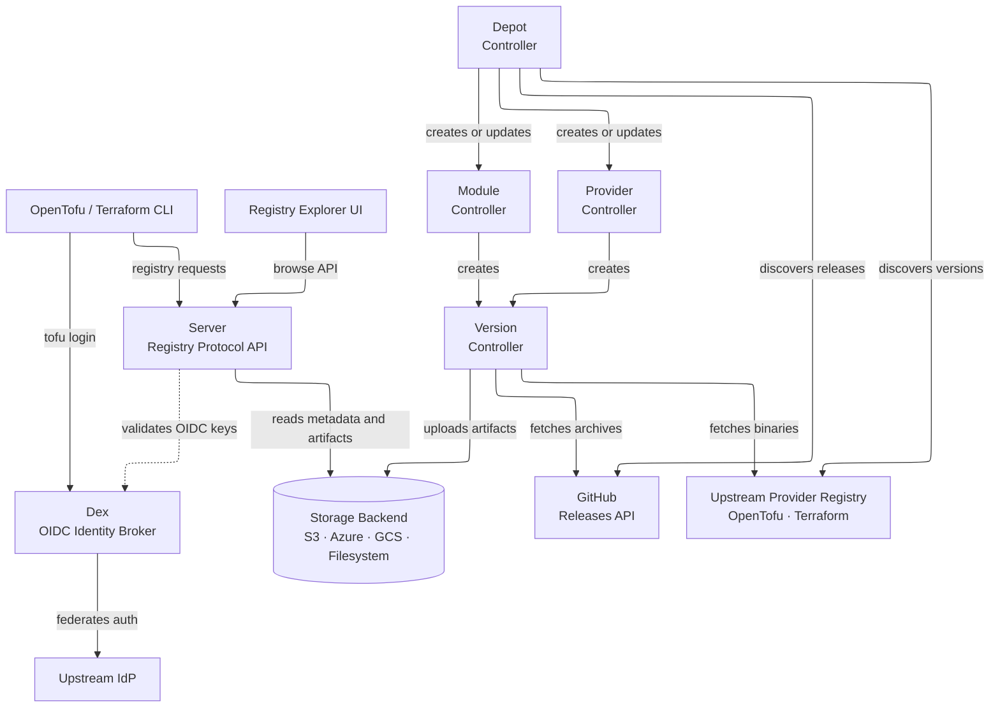

---
tags:
  - architecture
  - internals
  - kubernetes
---

# Architecture

OpenDepot is a Kubernetes-native registry. Kubernetes resources describe the
modules, providers, versions, and discovery jobs that OpenDepot should manage.
Controllers reconcile those resources, the server exposes them through the
OpenTofu and Terraform registry protocols, and a storage backend holds the
artifacts.

## System Overview

The diagram shows two cooperating paths:

- **Consumption:** OpenTofu, Terraform, and the Registry Explorer read metadata
  through the Server. The Server authenticates requests, reads Kubernetes
  resources, and serves or redirects artifacts from storage.
- **Reconciliation:** Depot discovers upstream releases and creates declarative
  `Module` and `Provider` resources. The Module and Provider controllers turn
  those resources into `Version` resources, and the Version controller fetches,
  scans, checksums, and stores the artifacts.

## Reconciliation Flow

1. A user creates a `Module`, `Provider`, or `Depot` resource.
2. The Depot controller polls GitHub and the configured provider registry when a
   `Depot` is present. It resolves version constraints and reconciles discovered
   modules and providers.
3. The Module controller creates one `Version` resource for each module version.
   The Provider controller creates one Version for each provider version and
   operating system/architecture combination.
4. The Version controller downloads the upstream artifact, computes its
   checksum, runs configured scans, and uploads it to storage.
5. The Server reads the Kubernetes resources and exposes synced versions through
   the registry protocols.
6. Subsequent reconciliations repair drift, discover new releases, and preserve
   immutable artifact content according to the configured policy.

## Components

### Depot Controller

The Depot controller is the discovery layer. It polls:

- GitHub Releases API for module releases
- `registry.opentofu.org` or `registry.terraform.io` for provider releases

It applies version constraints, creates or updates the corresponding `Module`
and `Provider` resources, and records the managed resource names in Depot
status. Configure the polling interval with `pollingIntervalMinutes`.

See [Depot Discovery](guides/depot.md) for configuration examples.

### Module and Provider Controllers

These controllers translate high-level registry resources into individual
version work items:

- The Module controller creates a Version for each entry in
  `Module.spec.versions`.
- The Provider controller creates a Version for each version and each requested
  operating system and architecture.
- Both controllers track the latest version, garbage-collect removed versions,
  and enforce `versionHistoryLimit` when configured.

A provider with two versions, two operating systems, and two architectures
produces eight Version resources.

### Version Controller

The Version controller performs the artifact work:

- Downloads module archives from GitHub or provider binaries from the configured
  upstream registry.
- Assigns stable UUID7 storage filenames and computes SHA256 checksums.
- Runs module IaC scans and provider binary/source scans when Trivy scanning is
  enabled.
- Generates provider `SHA256SUMS` signatures when provider GPG signing is
  configured.
- Uploads artifacts to the configured storage backend and updates Version
  status.

UUID7 filenames prevent clients from guessing storage object names. When module
immutability is enabled, reconciliation verifies that the stored checksum still
matches the published version.

### Server

The Server is the read-only registry API. It:

- Implements the Module Registry and Provider Registry protocols.
- Serves service discovery from `/.well-known/terraform.json`.
- Reads `Module`, `Provider`, `Version`, and access-control resources from the
  Kubernetes API.
- Serves artifacts directly or returns storage-native pre-signed redirects.
- Records download events in Valkey for the Registry Explorer statistics.

Authentication can use OIDC, Kubernetes bearer tokens, or anonymous access for
local evaluation. OIDC enables `tofu login` and applies `GroupBinding` rules to
JWT group claims. See [Authentication](authentication/index.md).

### Registry Explorer UI

The optional UI is a Next.js application fronted by NGINX. NGINX routes browser
pages to the UI and registry paths such as `/opendepot/*` and
`/.well-known/terraform.json` to the Server, keeping browser requests
same-origin.

The UI reads the Server's browse API to display modules, providers, versions,
scan findings, Depot relationships, and download statistics.

### Storage and Valkey

The chart supports S3, Azure Blob, Google Cloud Storage, and a shared
filesystem. The Version controller writes artifacts and the Server reads or
redirects downloads from the same backend.

Valkey stores download counters and timestamps for the Registry Explorer. It is
separate from registry state: Kubernetes stores the declarative resources and
status used by the controllers and Server.

## Design Principles

- **Kubernetes is the control plane.** Registry state, desired configuration,
  and reconciliation status are Kubernetes resources.
- **The Server is read-only.** Controllers and Kubernetes RBAC govern writes;
  clients consume the registry through standard protocols.
- **Discovery is declarative.** A Depot expresses what upstream sources and
  version constraints to follow; reconciliation handles the resulting updates.
- **Artifacts are immutable by policy.** Checksums, stable storage names, and
  optional immutability enforcement protect published versions.
- **Authentication is layered.** OIDC, Kubernetes bearer tokens, and anonymous
  access support different deployment stages without changing the registry
  model.
