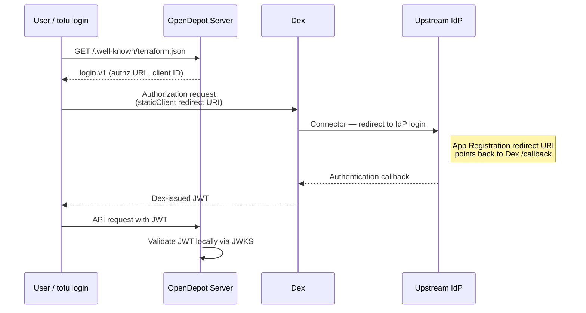

---
tags:
  - configuration
  - oidc
  - dex
  - authentication
  - sso
---

# OIDC Authentication (Dex)

OpenDepot ships Dex as a bundled Helm subchart that acts as an OIDC identity broker. Dex federates upstream IdPs (Entra ID, Okta, GitHub, LDAP, and more) and issues standard OIDC JWTs. The server validates those JWTs locally via JWKS — no Dex round-trip on every request.

When OIDC is enabled the server advertises the `login.v1` block in its service discovery response, which allows users to authenticate with `tofu login` instead of distributing kubeconfigs or service account tokens.

!!! note
    OIDC and bearer-token modes are mutually exclusive by default. Set `server.oidc.enabled: true` and `server.useBearerToken: false` when switching to OIDC. If you also need CI/CD pipelines to authenticate with a Kubernetes ServiceAccount, see [CI/CD with ServiceAccount Fallback](#cicd-with-serviceaccount-fallback) below.

## Prerequisites

- OpenDepot installed via Helm (see [Installation](../getting-started/installation.md))
- A publicly reachable hostname for OpenDepot (HTTPS required in production). Dex does not need its own separate hostname or ingress — see [Proxying Dex Through the Server](#recommended-proxy-dex-through-the-server) below.
- An upstream IdP OAuth application (GitHub App, Azure App Registration, Okta app, etc.)

## How Authentication Works

Dex acts as a broker between your upstream IdP and OpenDepot. There are two distinct registrations involved, and understanding them avoids the most common configuration mistakes.

**Connector (upstream registration)**
A connector tells Dex how to authenticate users against an external IdP such as Entra ID, Okta, or GitHub. You create an OAuth application in the IdP (e.g. an Azure App Registration), and configure Dex with the client credentials. The redirect URI on that application points to **Dex's callback URL** — never directly to OpenDepot.

**Static client (downstream registration)**
A static client registers OpenDepot as an application that *receives tokens from Dex*. The server's `clientId` must match a `staticClient` entry in the Dex config, and the redirect URIs on that client are the `localhost` ports used by `tofu login`.

These two registrations are entirely independent. Swapping or reconfiguring the upstream IdP (connector) does not affect the static client configuration, and vice versa.



## Step 1: Enable Dex

Set `dex.enabled: true` and configure the `issuer` and at least one connector in your Helm values. Dex expands `$ENV_VAR` references in its config at startup, so **never write connector secrets as plain string literals** — reference an environment variable instead and expose the value via `dex.envFrom`:

```yaml
dex:
  enabled: true
  config:
    issuer: https://opendepot.example.com/dex  # same host as the server ingress; see "Recommended" section below
    connectors:
      - type: github
        id: github
        name: GitHub
        config:
          clientID: <github-oauth-app-client-id>
          clientSecret: $GITHUB_CLIENT_SECRET  # (1)!
          redirectURI: https://opendepot.example.com/dex/callback
          org: my-org  # (optional) restrict to an organization
  envFrom:
    - secretRef:
        name: dex-connector-secrets  # (2)!
```

1. Dex substitutes `$GITHUB_CLIENT_SECRET` from the pod's environment at startup. The literal secret value never appears in the Helm values file or in-cluster ConfigMap.
2. A Kubernetes Secret that contains the environment variable(s) referenced in the connector config. Create it before deploying:
   ```bash
   kubectl create secret generic dex-connector-secrets \
     --from-literal=GITHUB_CLIENT_SECRET=<github-oauth-app-secret> \
     -n opendepot-system
   ```

!!! warning
    Do not write connector `clientSecret` values as plain strings in Helm values files. Those values are rendered into a Kubernetes ConfigMap and are visible to anyone with `kubectl get configmap` access on the namespace.

See [Connector Examples](#connector-examples) below for Entra ID (Azure AD) and other IdP configurations.

## Step 2: Enable OIDC on the Server

Add the `server.oidc` block to the same values file:

```yaml
server:
  useBearerToken: false
  oidc:
    enabled: true
    issuerUrl: https://opendepot.example.com/dex  # omit to auto-derive in-cluster Dex URL
    clientId: opendepot
    clientSecret: $STRONG_RANDOM_VALUE  # (1)!
```

1. Dex substitutes `$STRONG_RANDOM_VALUE` from the pod's environment at startup. The literal secret value never appears in the Helm values file or in-cluster ConfigMap.

!!! warning
    Do not commit `clientSecret` in plain text. Use an external secret operator (e.g., Sealed Secrets, External Secrets Operator) to inject the value in production. Alternatively, create the Secret manually and set `server.oidc.clientSecretName` to its name.

When `server.oidc.issuerUrl` is blank and `dex.enabled: true`, the chart auto-derives the in-cluster URL:

```
http://<release-name>-dex.<namespace>.svc.cluster.local:5556/dex
```

## Recommended: Proxy Dex Through the Server

By default, exposing Dex requires giving it its own public ingress and hostname. Set `server.oidc.dexProxy.enabled: true` instead to have the server reverse-proxy `/dex/*` requests to the bundled Dex service. Dex is never given its own ingress — operators expose only the existing `server.ingress` (or `ui.ingress`), which already routes `/dex` alongside the registry protocol paths.

Set Dex's `issuer` to the external, path-based URL the proxy will serve, and point `server.oidc.issuerUrl` at the exact same value:

```yaml
dex:
  enabled: true
  config:
    issuer: https://opendepot.example.com/dex  # same host as the server ingress

server:
  oidc:
    enabled: true
    issuerUrl: https://opendepot.example.com/dex  # must match dex.config.issuer exactly
    clientId: opendepot
    clientSecret: $STRONG_RANDOM_VALUE
    dexProxy:
      enabled: true
```

Internally, the server still discovers Dex and fetches its JWKS via the in-cluster service address — it never calls back out through its own public ingress. Because Dex's `issuer` is the external URL, every value Dex reports (the OIDC discovery document, `authorization_endpoint`, `token_endpoint`, and the device-code flow's `verification_uri`) is already correct for external clients; the proxy performs no path rewriting or response modification.

This mode supports all three flows — `tofu login`'s authorization code and device code grants, and the [client credentials grant](#client-credentials-machine-to-machine) used by CI/CD — purely through the server's existing ingress.

!!! note
    `server.oidc.authzUrl` and `server.oidc.tokenUrl` are no longer necessary with `dexProxy.enabled: true`, since `login.v1` is populated directly from Dex's own (now-external) discovery document. They remain available as manual overrides for edge cases — see [Split-Network OIDC](#split-network-oidc-authzurl--tokenurl) below.

!!! warning "dex.enabled=true is required"
    `dexProxy.enabled: true` only works with the bundled Dex subchart (`dex.enabled: true`). It has no effect — and the Helm render fails — if you point `server.oidc.issuerUrl` at an [external, shared Dex](#shared--external-dex-multi-tenant) instance instead.

## Step 3: Apply the Helm Upgrade

```bash
helm upgrade opendepot opendepot/opendepot \
  -n opendepot-system \
  --reuse-values \
  -f oidc-values.yaml \
  --wait
```

Verify the server pod is running and OIDC flags appear in the container args:

```bash
kubectl get pods -n opendepot-system
kubectl describe pod -n opendepot-system -l app=server | grep oidc
```

## Step 4: Verify Service Discovery

When OIDC is enabled the `/.well-known/terraform.json` response includes a `login.v1` object:

```bash
curl https://opendepot.example.com/.well-known/terraform.json
```

```json
{
  "modules.v1": "/opendepot/modules/v1/",
  "providers.v1": "/opendepot/providers/v1/",
  "login.v1": {
    "authz": "https://opendepot.example.com/dex/auth",
    "token": "https://opendepot.example.com/dex/token",
    "grant_types": ["authz_code", "device_code"],
    "scopes": ["openid", "profile", "email", "groups"],
    "client": "opendepot"
  }
}
```

The `authz` and `token` URLs shown above assume `server.oidc.dexProxy.enabled: true` (the recommended default), so they share the same host as the rest of the registry API. Without the proxy, these would instead point at wherever Dex itself is exposed.

The `scopes` array tells the OpenTofu CLI which scopes to request during the OIDC login flow. The `groups` scope is required for the `groups` claim to be present in the issued JWT and therefore for `GroupBinding` evaluation to work.

If `login.v1` is absent, OIDC is not enabled or the server has not restarted after the Helm upgrade.

### Split-Network OIDC (authzUrl / tokenUrl)

!!! note
    This section covers a manual, edge-case override. When [`server.oidc.dexProxy.enabled: true`](#recommended-proxy-dex-through-the-server) (the recommended default), `login.v1` already advertises the correct external URLs automatically and `authzUrl`/`tokenUrl` are not needed.

In some deployments the server must discover Dex via an in-cluster URL (for JWKS fetching and token validation), but the `login.v1` endpoints advertised to CLI clients must be reachable from outside the cluster — for example, through an ingress or a port-forward.

Use `server.oidc.authzUrl` and `server.oidc.tokenUrl` to override the authorization and token URLs that appear in `/.well-known/terraform.json` independently of the `issuerUrl` used for token validation:

```yaml
server:
  oidc:
    enabled: true
    # In-cluster Dex URL — used for JWKS discovery and token validation only.
    issuerUrl: http://opendepot-dex.opendepot-system.svc.cluster.local:5556/dex
    # External URLs advertised to tofu CLI clients via login.v1.
    authzUrl: https://dex.defdev.io/dex/auth
    tokenUrl: https://dex.defdev.io/dex/token
```

When either value is blank the URL comes from the Dex OIDC discovery document. Both values are validated at server startup — the server exits immediately if either URL is not a well-formed `http` or `https` URL.

!!! note "Local Kind testing"
    The local Kind Make targets (`oidc-deploy`, `ui-deploy`) use [`server.oidc.dexProxy.enabled: true`](#recommended-proxy-dex-through-the-server) instead of this pattern, since it only requires a single port-forward. See [Local OIDC E2E Testing](../contributing.md#local-oidc-e2e-testing) for the contributor workflow.

### Shared / External Dex (Multi-Tenant)

Use this pattern when multiple OpenDepot releases share a cluster and you want a single Dex instance to manage identity for all of them, rather than deploying one Dex pod per registry.

!!! note
    The [server-proxied Dex](#recommended-proxy-dex-through-the-server) mode does not apply here — `dexProxy.enabled` requires the bundled Dex subchart (`dex.enabled: true`). A shared, externally managed Dex must be given its own reachable hostname (`dex.defdev.io` in the examples below).

When `server.oidc.issuerUrl` is set explicitly the chart uses it directly — `dex.enabled` controls only whether the bundled Dex subchart is deployed. Set `dex.enabled: false` to skip the subchart entirely and point the server at any OIDC-compliant issuer:

```yaml
dex:
  enabled: false  # do not deploy the bundled Dex subchart

server:
  oidc:
    enabled: true
    issuerUrl: "https://dex.defdev.io/dex"
    clientId: "opendepot-team-a"  # must match a staticClient id in the shared Dex
```

!!! note
    `server.oidc.clientSecret` and `server.oidc.clientSecretName` are ignored when `dex.enabled: false`. The chart creates no Kubernetes Secret and the server binary never reads the client secret — JWT validation uses the issuer's public JWKS endpoint. Client registration in the shared Dex is an out-of-band operator responsibility.

#### Registering Clients in the Shared Dex

Each OpenDepot instance requires its own `staticClient` entry in the shared Dex config. Add a client block for each release, including all redirect URIs that `tofu login` may use:

```yaml
staticClients:
  - id: opendepot-team-a
    name: OpenDepot Team A
    public: true
    redirectURIs:
      - http://localhost:10000/login
      - http://localhost:10001/login
      - http://localhost:10002/login
      - http://localhost:10003/login
      - http://localhost:10004/login
      - http://localhost:10005/login
      - http://localhost:10006/login
      - http://localhost:10007/login
      - http://localhost:10008/login
      - http://localhost:10009/login
      - http://localhost:10010/login
  - id: opendepot-team-b
    name: OpenDepot Team B
    public: true
    redirectURIs:
      - http://localhost:10000/login
      # ... same redirect URIs as above
```

#### Client ID Uniqueness

Each OpenDepot release should use a distinct `server.oidc.clientId` registered in the shared Dex. Two releases sharing the same client ID share an OIDC client — access is still scoped per-instance through `GroupBinding`, but there is no Dex-level isolation between the instances. Distinct IDs are strongly recommended.

| Release | Namespace | `server.oidc.clientId` | `server.oidc.issuerUrl` |
|---------|-----------|------------------------|-------------------------|
| `opendepot-team-a` | `team-a` | `opendepot-team-a` | `https://dex.defdev.io/dex` |
| `opendepot-team-b` | `team-b` | `opendepot-team-b` | `https://dex.defdev.io/dex` |

If the shared Dex is reachable in-cluster at a different address than external `tofu login` clients need, combine `issuerUrl` with `authzUrl` and `tokenUrl` as described in [Split-Network OIDC](#split-network-oidc-authzurl--tokenurl) above.

## Step 5: Authenticate with `tofu login`

Users run `tofu login` once and obtain a JWT that is cached locally:

```bash
tofu login opendepot.example.com
```

OpenTofu opens a browser window redirecting to Dex. After signing in through the upstream IdP, Dex issues a JWT and OpenTofu stores it in `~/.terraform.d/credentials.tfrc.json`. Subsequent `tofu init`, `tofu plan`, and `tofu apply` commands send the JWT as a bearer token automatically.

On headless systems (CI, servers), the device code flow is used instead — OpenTofu prints a URL and a short code to enter in a browser elsewhere.

## Connector Examples

=== "Entra ID (Azure AD)"

    ```yaml
    dex:
      enabled: true
      config:
        issuer: https://opendepot.example.com/dex
        connectors:
          - type: microsoft
            id: microsoft
            name: "Azure AD"
            config:
              clientID: <azure-app-id>
              clientSecret: $AZURE_CLIENT_SECRET
              redirectURI: https://opendepot.example.com/dex/callback
              tenant: <azure-tenant-id>
      envFrom:
        - secretRef:
            name: dex-connector-secrets
    ```

    ```bash
    kubectl create secret generic dex-connector-secrets \
      --from-literal=AZURE_CLIENT_SECRET=<azure-app-secret> \
      -n opendepot-system
    ```

=== "GitHub"

    ```yaml
    dex:
      enabled: true
      config:
        issuer: https://opendepot.example.com/dex
        connectors:
          - type: github
            id: github
            name: GitHub
            config:
              clientID: <github-oauth-app-client-id>
              clientSecret: $GITHUB_CLIENT_SECRET
              redirectURI: https://opendepot.example.com/dex/callback
              org: my-org
      envFrom:
        - secretRef:
            name: dex-connector-secrets
    ```

    ```bash
    kubectl create secret generic dex-connector-secrets \
      --from-literal=GITHUB_CLIENT_SECRET=<github-oauth-app-secret> \
      -n opendepot-system
    ```

=== "Okta"

    ```yaml
    dex:
      enabled: true
      config:
        issuer: https://opendepot.example.com/dex
        connectors:
          - type: oidc
            id: okta
            name: Okta
            config:
              issuer: https://<okta-domain>/oauth2/default
              clientID: <okta-client-id>
              clientSecret: $OKTA_CLIENT_SECRET
              redirectURI: https://opendepot.example.com/dex/callback
      envFrom:
        - secretRef:
            name: dex-connector-secrets
    ```

    ```bash
    kubectl create secret generic dex-connector-secrets \
      --from-literal=OKTA_CLIENT_SECRET=<okta-client-secret> \
      -n opendepot-system
    ```

For the full list of supported connectors and their configuration options, see the [Dex Connector Documentation](https://dexidp.io/docs/connectors/).

## Client Secret Management

The Dex client secret authenticates the OpenDepot client application to Dex. It is **not** used by the server to validate tokens — the server validates JWTs using the issuer's public JWKS endpoint.

The chart manages the secret in two ways:

| Scenario | Configuration |
|----------|--------------|
| Auto-create from value | Leave `server.oidc.clientSecretName` blank; set `server.oidc.clientSecret` to the desired value. The chart creates an `opendepot-dex-client-secret` Secret automatically. |
| Use an existing Secret | Set `server.oidc.clientSecretName` to the name of a pre-existing Secret that contains a `clientSecret` key. The chart skips Secret creation. |

!!! warning "Production requirement"
    When both `dex.enabled` and `server.oidc.enabled` are `true`, the Helm chart requires either `server.oidc.clientSecret` or `server.oidc.clientSecretName` to be set. The render fails if both are blank. For production, create a Kubernetes Secret containing the client secret and reference it via `server.oidc.clientSecretName` rather than storing the secret value inline in `values.yaml`.

    ```bash
    kubectl create secret generic my-oidc-client-secret \
      --from-literal=clientSecret=<strong-random-value> \
      -n opendepot-system
    ```

    ```yaml
    server:
      oidc:
        clientSecretName: my-oidc-client-secret
    ```

!!! warning
    The client secret is injected only into the Dex deployment via `envFrom`. The OpenDepot server container never receives it.

### Connector Secrets

Connector `clientSecret` values (GitHub, Entra ID, Okta, etc.) are separate from the OpenDepot client secret above. Dex expands `$ENV_VAR` references in its config YAML at startup, so the recommended pattern is:

1. Store the IdP secret in a Kubernetes Secret
2. Reference it with `$ENV_VAR` in the connector config
3. Mount the Secret into the Dex pod using `dex.envFrom`

The chart's default `dex.envFrom` already mounts `opendepot-dex-client-secret`. To add connector secrets, append your own `secretRef` entries:

```yaml
dex:
  envFrom:
    - secretRef:
        name: opendepot-dex-client-secret  # chart default — do not remove
        optional: true
    - secretRef:
        name: dex-connector-secrets  # your connector IdP secrets
```

This keeps all secret values out of Helm values files and in-cluster ConfigMaps, where they would be visible to anyone with `kubectl get configmap` access on the namespace.

## Fine-Grained Access Control (GroupBinding)

After OIDC is enabled, you can deploy `GroupBinding` resources to restrict which modules and providers each group of users may access. The server extracts the groups claim from the JWT and evaluates GroupBindings in alphabetical order by name. The first matching binding determines the allowed resources. If a binding expression fails to compile or evaluate, the request is denied with `403 Forbidden`.

### Groups Claim Name

By default the server reads the `groups` JWT claim. If your IdP uses a different name, set `server.oidc.groupsClaim`:

```yaml
server:
  oidc:
    groupsClaim: "cognito:groups"  # default is "groups"
```

### Required Groups Claim

The groups claim is **required** for interactive OIDC users. A valid JWT that does not carry the configured claim is denied with **403 Forbidden**. Configure your IdP connector in Dex to emit the claim before enabling OIDC in production.

The one exception is [client credentials](#client-credentials-machine-to-machine) tokens. When `server.oidc.allowClientCredentials` is enabled, the server synthesizes a virtual group from the token's `sub` claim (`"client:<sub>"`), so a groups claim is not required in the JWT itself.

See [Fine-Grained Access Control with GroupBinding](../guides/groupbinding.md) for a complete guide, including expression syntax, glob pattern reference, and example manifests.

## Security Notes

- **HTTPS required in production**: The Dex `issuer` URL must use HTTPS. HTTP is accepted only for `127.0.0.1` and in-cluster addresses.
- **JWT validation is local**: The server fetches JWKS from Dex at startup and caches them. No request to Dex is made per API call.
- **Token lifetime**: JWTs are short-lived (typically 1 hour). Users re-run `tofu login` to refresh; CI systems use the device code flow.
- **No `staticPasswords` in production**: The `dex.config.enablePasswordDB` and `dex.config.staticPasswords` options exist for automated e2e testing only. Never enable them in production environments.
- **Dex v2.45.0 required for groups in staticPasswords**: Dex v2.44.0 does not include the `groups` field in tokens issued for `staticPasswords` users. If you rely on groups-based `GroupBinding` expressions with static users (e.g. in e2e tests), set `dex.image.tag: v2.45.0` in your Helm values:

    ```yaml
    dex:
      image:
        tag: v2.45.0
    ```

For a full comparison of all authentication methods, see [Authenticating with OpenDepot](../authentication.md).

## CI/CD with ServiceAccount Fallback

By default, when OIDC is enabled every token must be a valid Dex JWT. This blocks CI/CD pipelines that use a Kubernetes ServiceAccount to authenticate — the SA token has a different issuer and will be rejected with `401 Unauthorized`.

Set `server.oidc.allowServiceAccountFallback: true` to opt in to mixed-mode authentication:

```yaml
server:
  oidc:
    enabled: true
    allowServiceAccountFallback: true
```

With this flag, the server inspects the `iss` claim of any token that fails OIDC verification. If the issuer does not match the configured OIDC issuer URL, the token is forwarded to the Kubernetes API as a bearer token and the SA's own RBAC determines access. GroupBinding is not evaluated for SA tokens — it is an OIDC-layer concern only.

| Token | Behaviour |
|---|---|
| Valid Dex JWT | OIDC path → GroupBinding → server SA for K8s calls |
| Bad/expired Dex JWT | `401 Unauthorized` (issuer matches, not a fallback candidate) |
| K8s SA token | Bearer token path → SA's own RBAC controls access |
| Garbage non-JWT | `401 Unauthorized` |

!!! note
    Tokens that claim the OIDC issuer but fail signature or expiry checks are **never** routed to the SA fallback path. Only tokens from a clearly different issuer fall back.

### Required RBAC for SA tokens

The SA must have `get` and `list` verbs on the resources it needs to access. For a pipeline that downloads modules and providers:

```yaml
apiVersion: rbac.authorization.k8s.io/v1
kind: Role
metadata:
  name: opendepot-registry-reader
  namespace: opendepot-system
rules:
- apiGroups: ["opendepot.defdev.io"]
  resources: ["modules", "versions", "providers"]
  verbs: ["get", "list"]
---
apiVersion: rbac.authorization.k8s.io/v1
kind: RoleBinding
metadata:
  name: opendepot-registry-reader-binding
  namespace: opendepot-system
roleRef:
  apiGroup: rbac.authorization.k8s.io
  kind: Role
  name: opendepot-registry-reader
subjects:
- kind: ServiceAccount
  name: my-ci-sa
  namespace: my-ci-namespace
```

For guidance on using this in a CI/CD pipeline, see [Registry Reads: SA Fallback with OIDC](../guides/cicd.md#registry-reads-sa-fallback-with-oidc).

## Client Credentials (Machine-to-Machine)

When your organization uses OIDC for human users and you need CI/CD pipelines or automated services to authenticate **without** distributing kubeconfigs or SA tokens, enable the Dex client credentials flow.

A service obtains a short-lived Dex access token using the [OAuth2 client credentials grant](https://www.rfc-editor.org/rfc/rfc6749#section-4.4) and presents it as a bearer token. Access is controlled through the standard `GroupBinding` mechanism — the token's `sub` claim (the Dex client ID) is mapped to a virtual group `"client:<sub>"` which GroupBinding expressions can match.

!!! note
    Client credentials tokens are issued with `aud=<client-id>` (e.g. `aud=ci-pipeline`), not `aud=opendepot`. A secondary verifier that skips the audience check (but still validates the Dex signature and expiry) is used to accept them. User tokens that pass the primary audience check are **not** affected by this setting.

!!! note "ROPC tokens and other Dex clients"
    The CC path is triggered for **any** Dex-issued token whose audience does not match the primary OpenDepot client ID — not only tokens obtained via `grant_type=client_credentials`. This includes tokens issued to separate Dex clients using the Resource Owner Password Credentials (ROPC) grant. Those tokens are routed through the same secondary verifier and their `sub` claim is mapped to a `"client:<sub>"` virtual group in exactly the same way. If you have ROPC clients in your Dex configuration, ensure each has a dedicated `GroupBinding` with a specific expression so their access scope is intentional.

### Step 1: Register a CC client in Dex

Add a `staticClient` entry with `grantTypes: ["client_credentials"]` to your Dex config. The `id` becomes the identity of the machine client — use a descriptive name for your pipeline or service.

```yaml
dex:
  config:
    oauth2:
      grantTypes:
        - authorization_code
        - client_credentials # add this
    staticClients:
      - id: opendepot
        name: OpenDepot
        secretEnv: OPENDEPOT_DEX_CLIENT_SECRET
        redirectURIs:
          - https://opendepot.example.com/...
      - id: ci-pipeline # machine client
        name: CI Pipeline
        secretEnv: OPENDEPOT_CC_CLIENT_SECRET
        grantTypes:
          - client_credentials
  envFrom:
    - secretRef:
      name: opendepot-dex-client-secret # chart default — do not remove
      optional: true
    - secretRef:
        name: opendepot-cc-client-secret
```

!!! warning
    Manage the CC client secret as you would any other credential. Use an external secret operator or inject it from a secrets manager rather than committing it in plain text.

### Step 2: Enable CC auth on the server

```yaml
server:
  oidc:
    enabled: true
    allowClientCredentials: true
```

### Step 3: Create a GroupBinding for the CC client

The CC client's Dex `id` (e.g. `ci-pipeline`) is exposed as `"client:ci-pipeline"` in the virtual groups list. Write a `GroupBinding` that matches it:

```yaml
apiVersion: opendepot.defdev.io/v1alpha1
kind: GroupBinding
metadata:
  name: ci-pipeline-binding
  namespace: opendepot-system
spec:
  expression: '"client:ci-pipeline" in groups'
  moduleResources:
    - "*"
  providerResources:
    - "*"
```

!!! warning "Use specific `client:` expressions — avoid broad patterns"
    Always match a precise `"client:<sub>"` value in your expression rather than a pattern that accepts any `client:`-prefixed group. An expression such as `'filter(groups, {# startsWith("client:")}) != []'` would grant access to **every** machine client registered in Dex, including any added in the future. Define one `GroupBinding` per machine client and pin the exact `sub` value (which equals the Dex client `id` for CC flows).

### Step 4: Obtain and use a token

Exchange the client credentials for an access token:

```bash
TOKEN=$(curl -s -X POST https://opendepot.example.com/dex/token \
  -d grant_type=client_credentials \
  -d client_id=ci-pipeline \
  -d client_secret=<secret> \
  -d scope=openid \
  | jq -r '.access_token')
```

The example above assumes `server.oidc.dexProxy.enabled: true`, so the token endpoint shares the main registry host. Against a [shared, externally exposed Dex](#shared--external-dex-multi-tenant), use that Dex's own hostname (e.g. `https://dex.defdev.io/dex/token`) instead.

Use the token in `.tofurc`:

```hcl
credentials "opendepot.example.com" {
  token = "<access_token>"
}
host "opendepot.example.com" {
  services = {
    "modules.v1"   = "https://opendepot.example.com/opendepot/modules/v1/"
    "providers.v1" = "https://opendepot.example.com/opendepot/providers/v1/"
  }
}
```

No `tofu login` is required — the access token is used directly.

### Comparison with SA Fallback

| | SA Fallback | Client Credentials |
|---|---|---|
| Token source | `kubectl create token` | Dex `client_credentials` grant |
| Requires cluster API access | Yes (to mint SA token) | No |
| Access control | Kubernetes RBAC | `GroupBinding` |
| Works without `kubectl` | No | Yes |
| Short-lived tokens | Yes (configurable) | Yes (Dex-controlled TTL) |

For CI/CD usage examples see [Client Credentials in CI/CD](../guides/cicd.md#registry-reads-with-dex-client-credentials).

## Local OIDC Testing

Local OIDC end-to-end testing via repository `make` targets is contributor-focused developer workflow documentation.

See [Contributing](../contributing.md#local-oidc-e2e-testing) for the full local Kind + Dex test setup and command reference.
