---
tags:
  - assembly-line
  - modules
  - providers
  - opentofu
---

# Assembly Line

Assembly Line composes onboarded OpenDepot modules and providers into a validated OpenTofu root module, directly in the browser. An administrator must enable it first; see [Assembly Line Configuration](../configuration/assembly-line.md).

Assembly Line is **OpenTofu-only** and **browser-local/export-only**: canvases persist in the browser's `localStorage` (nothing is saved server-side), and the only server-side artifact is the validated ZIP produced at export time.

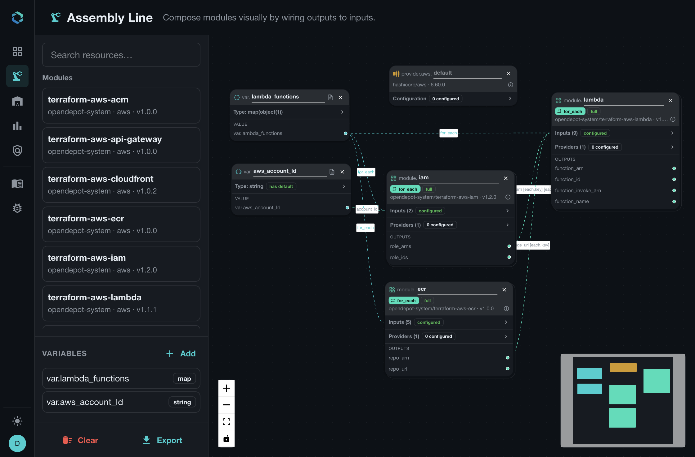

## The Assembly Line Workflow

Assembly Line turns a visual canvas into a portable OpenTofu root module:

1. Add a module, provider, or variable from the resource palette.
2. Configure inputs and provider arguments from the node panels.
3. Wire variables and module outputs to downstream inputs.
4. Choose `count` or `for_each` when a module should produce multiple instances.
5. Export the validated `main.tf` and `variables.tf` files.

The canvas is local to your browser. OpenDepot does not save it as a server-side
resource, so you can experiment freely and export only when the graph is ready.

## Build a Root Module

Add module, provider, and variable nodes to the canvas. Module and provider nodes select a specific onboarded release. When exported, module releases use pessimistic constraints and provider releases remain exact. Module inputs and provider configuration fields are rendered only when they are set on the canvas; defaults owned by the child module or provider remain in the child configuration.

Variable nodes become declarations in `variables.tf`. A variable default is emitted only when the canvas defines one. Recursive collection, tuple, object, and optional object attribute types are preserved.

References can connect a root variable or module output to a module input or provider argument. Repeated modules support `count` and `for_each`; references to repeated modules require an explicit all/index/key selector.

Building a canvas node requires the underlying module or provider version to already have an extracted Assembly artifact. Versions without these artifacts are not offered on the canvas. See [Assembly Line Configuration](../configuration/assembly-line.md#provider-and-module-requirements) for the administrator requirements.

## Define Complex Variables

Variables are first-class canvas nodes. Open **Type** on a variable to choose a
primitive, collection, tuple, or object type. Add nested object attributes and
set optional or default values in the type editor. Its syntax-highlighted HCL
preview shows the equivalent OpenTofu declaration as you build the type.

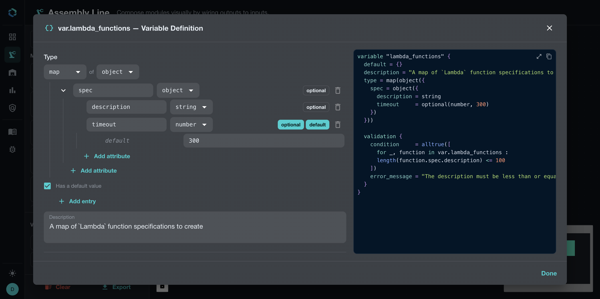

This example defines a map whose values contain a nested `spec` object with
`description` and `timeout` attributes. That shape is useful for `for_each`
because each map key identifies one module instance and each value carries that
instance's configuration.

### Validate Variable Values

Add one or more validations to reject invalid input before the generated root
module is used. Enter each condition as an HCL expression; syntax highlighting
distinguishes functions, variables, and nested attributes while you edit. Each
validation has two parts:

- A condition written as an HCL expression, such as `length(var.spec.description) > 100`.
- An error message that explains how to correct the value.

The condition can reference the variable and its nested attributes. The HCL
preview renders the validation block in the generated OpenTofu declaration, so
the constraint travels with the exported `variables.tf` file.

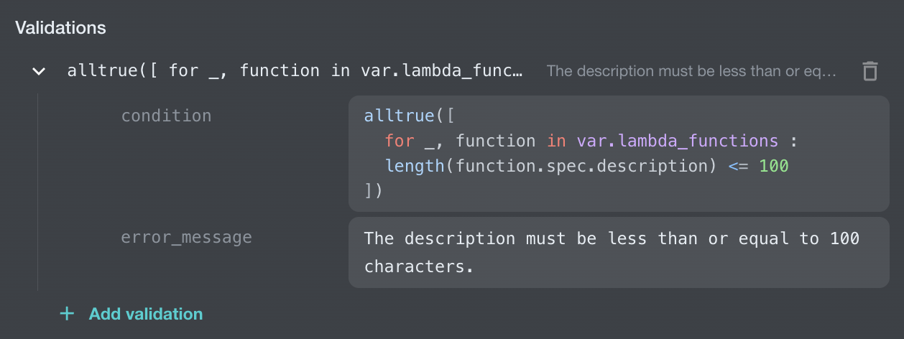

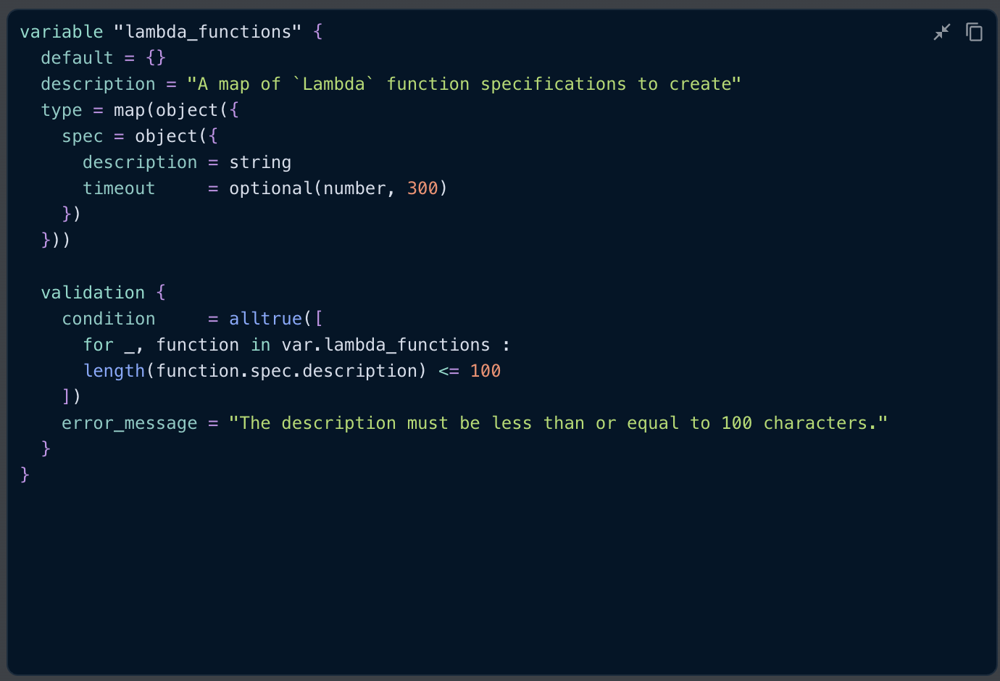

## Configure Module Inputs

Select **Inputs** on a module node to open its typed input form. Compact rows
show each input's required or optional status, accepted type, and value
controls. Collection entries are grouped under their input, and the generated
module HCL remains visible beside the form. Use the search box and pagination
controls when a module exposes many inputs.

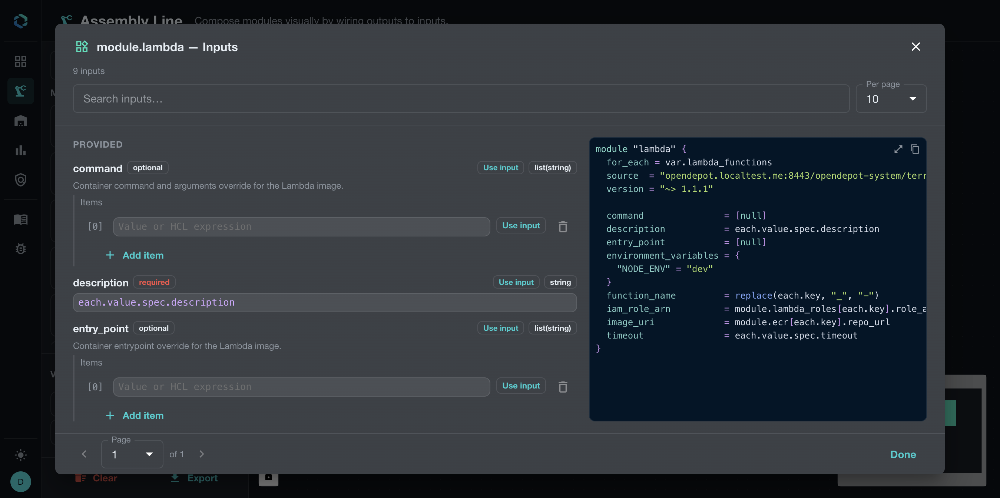

Enter literal values or HCL expressions in the value fields. Expressions are
syntax highlighted. When a field contains a supported OpenTofu function, the
editor displays a short function description and a link to the OpenTofu
documentation beneath the field.

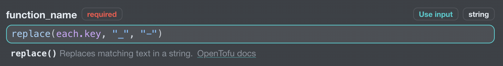

Values can come from several places:

- A literal value entered in the form.
- A root variable such as `var.account_id`.
- A module output such as `module.ecr.repo_url`.
- A repeated value such as `each.key` or `each.value.spec.description`.

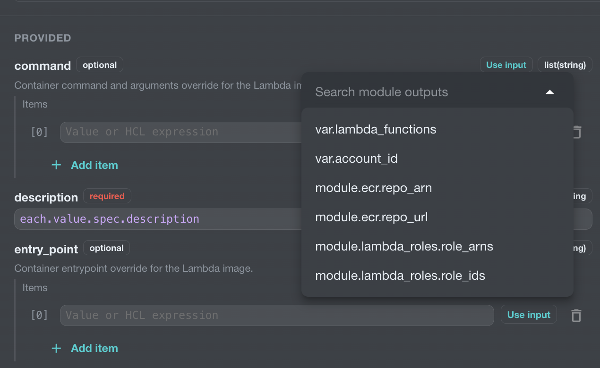

Enter literal values directly in an input field. To reference a root variable or
module output, choose **Use input** and select a source from the menu. When a
source is repeated or contains a collection, the form provides instance
selectors and key or index controls.

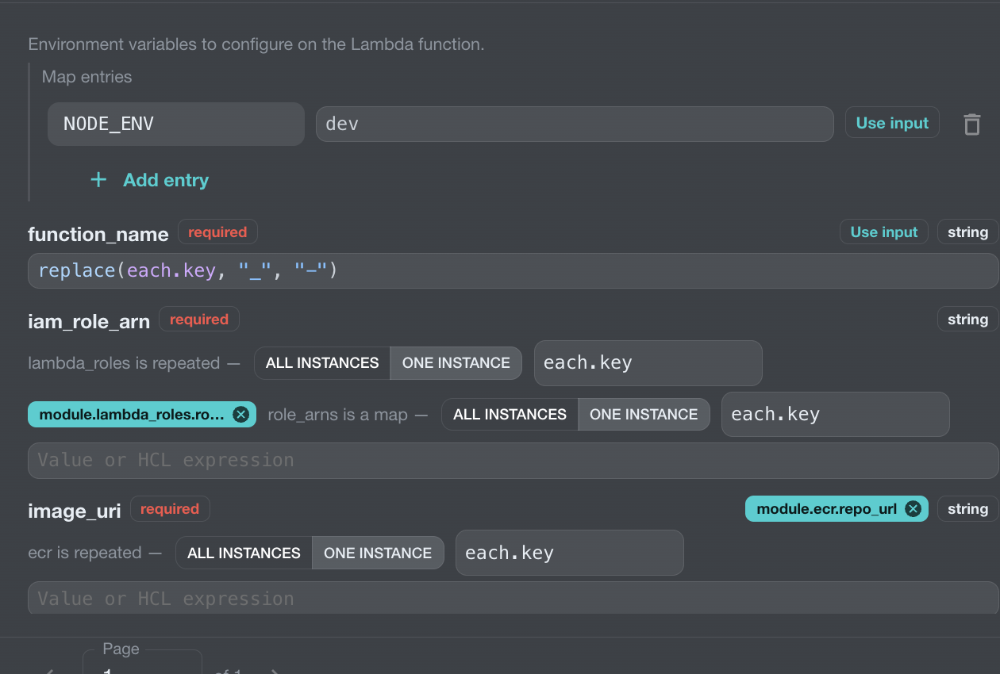

Repeated modules can also use `each.key` and `each.value` in HCL expression
fields. For example, this description input reads a nested value from the
current `for_each` object:

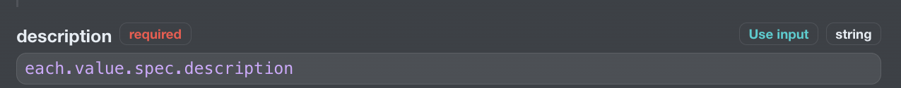

For a variable map or collection reference, choose **One instance** and enter
the index or key expression to select one entry. When the selected entry is an
object, optionally choose a descendant property. For example, selecting
`var.lambda_functions`, **One instance**, `each.key`, and `spec` produces:

```hcl
var.lambda_functions[each.key].spec
```

Leave the descendant selection at **Whole value** to reference the complete
entry. Choosing **All instances** clears the descendant selection and passes
the full collection. Type compatibility checks use the selected entry or
projected property type.

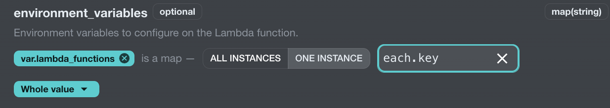

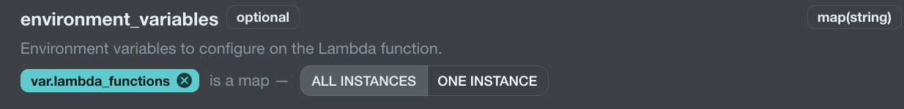

The form keeps the expression visible on the canvas, so you can review how
each module is connected without opening every field. Defaults owned by the
child module remain there unless you explicitly configure the input.

## Repeat Modules with `count` or `for_each`

New module nodes start in **single** mode. Check the mode badge on the module
card before configuring its inputs. When you need multiple instances, open
**Repeat this module with `count` or `for_each`** and choose the repetition
mode that matches your input collection.

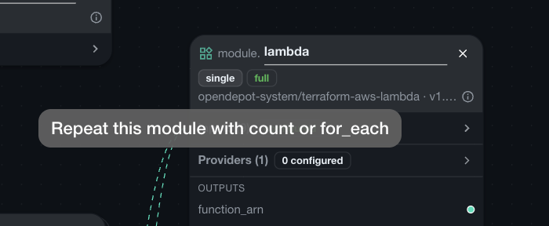

With `count`, choose **Fixed number** to create the specified number of
instances. Choose **Conditional (create or not)** to create either zero or one
instance from a boolean condition. Fixed-count instances use numeric indexes
such as `module.lambda[0]`; conditional instances use the same indexed form
when they exist.

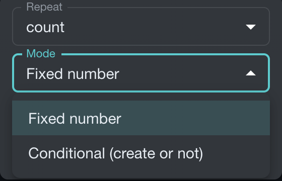

### Use `for_each` for Keyed Instances

Use `for_each` when each instance should have a stable key or its own value.
Connect a map or set variable to the module's repetition input. In the example
canvas, `var.lambda_functions` is a map of objects and drives the Lambda, IAM,
and ECR modules.

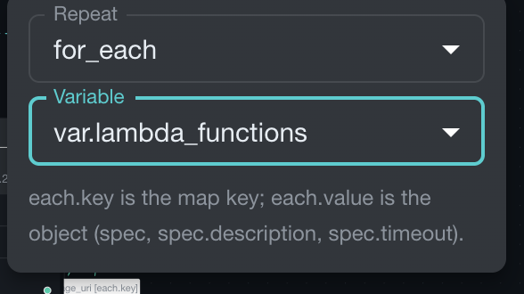

Each repeated module exposes the standard OpenTofu instance context:

- `each.key` is the map key or set member identifying the current instance.
- `each.value` is the object or value associated with that key.

Use `each.value` to populate instance-specific inputs, for example:

```hcl
description = each.value.spec.description
```

Use `each.key` when the key itself is the useful value, such as a function name:

```hcl
function_name = each.key
```

The UI only offers `each.*` expressions where the surrounding node is repeated,
so the generated configuration remains valid OpenTofu.

## Connect Repeated Outputs

When a repeated module output is a map, Assembly Line asks how to select it.
Choose **All instances** to pass the complete map, or **One instance** and
provide a key expression such as `each.key` to select the matching value.

For example, a repeated IAM module can provide one role ARN per function:

```hcl
iam_role_arn = module.iam.role_arns[each.key]
```

The same selector appears when connecting an output from a repeated ECR module:

```hcl
image_uri = module.ecr.repo_arns[each.key]
```

This makes it possible to build a complete fan-out graph while keeping every
Lambda instance paired with its corresponding IAM role and container image.

## Providers

Provider nodes must reference onboarded OpenDepot `Provider` resources with an extracted configuration schema. Configure required and optional attributes and nested blocks from that schema.

A module's provider selector lists only provider nodes whose upstream identity matches the module contract. For example, a module requirement for `hashicorp/aws` can bind to an onboarded OpenDepot Provider whose `providerNamespace/name` is `hashicorp/aws`.

Multiple configurations of one provider share one `required_providers` entry. Give additional configurations an alias, then bind each module-local provider name to the appropriate root configuration.

Select **Configuration** on a provider node to configure provider arguments from
the extracted schema. The paginated form marks optional attributes and shows
complex attribute types, such as `map(string)`, alongside their value controls.
Add or remove nested blocks such as `assume_role` and configure their fields
inline. A provider-specific HCL preview shows the provider configuration as it
is assembled. Provider values support the same typed expression references as
module inputs.

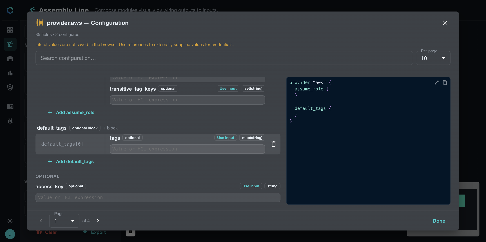

Provider configuration belongs on the root provider node. Modules then select
the matching provider configuration through their **Providers** panel, keeping
provider setup separate from module input wiring.

### OpenTofu-only eligibility

OpenDepot's provider registry generally mirrors both `registry.opentofu.org` and `registry.terraform.io` origins (see [Consuming Providers](providers.md)). Assembly Line is narrower: it only supports providers whose `spec.providerConfig.upstreamRegistry` resolves to `registry.opentofu.org`.

- The `/assembly` provider palette in the UI filters out any Provider whose upstream registry is not `registry.opentofu.org`, so Terraform-origin providers never appear as candidates.
- Export resolution enforces the same rule authoritatively on the server: a canvas that references a non-OpenTofu Provider fails with a `provider_registry_unsupported` diagnostic, regardless of what the browser submitted.

Provider schema extraction itself is unaffected by this restriction — the version controller extracts a configuration schema for every provider version using its configured `upstreamRegistry`, so both origins remain fully usable outside Assembly Line.

### Generated provider source

Generated provider source addresses use the provider's **canonical short identity**, never the OpenDepot host:

```text
<providerNamespace>/<providerName>
```

For example, an onboarded Provider with `providerNamespace: hashicorp` and `providerName: aws` renders `source = "hashicorp/aws"` in `required_providers`. OpenDepot is only the *installation location* configured in the generated OpenTofu CLI config, never the provider's identity in HCL.

Generated module source addresses continue to use the OpenDepot module registry host:

```text
<ui.baseUrl host>/<kubernetes namespace>/<Module resource name>/<provider system>
```

Module versions are emitted as pessimistic constraints without a leading `v`. For example, selecting module version `1.1.1` produces:

```hcl
version = "~> 1.1.1"
```

Provider versions remain exact and are emitted without a leading `v`.

## Export

Export sends the typed canvas to the OpenDepot server. OpenDepot validates the
canvas, resolves the selected versions, runs OpenTofu initialization, and
returns a ZIP containing the generated root module. Validation failures are
shown in the export dialog, and no ZIP is returned.

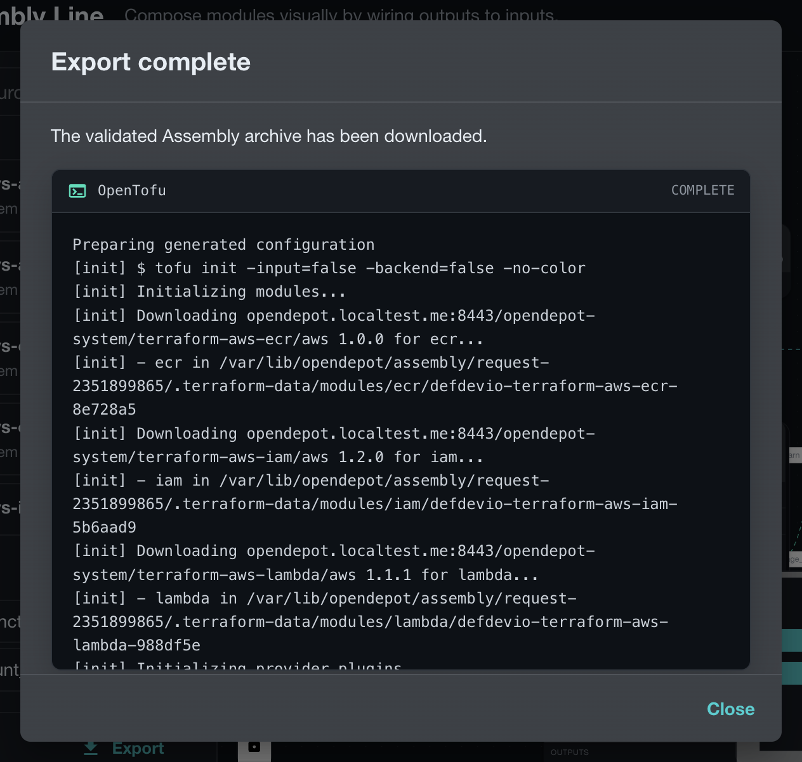

### Downloaded files

A successful download is named `assembly-line.zip` and contains exactly:

```text
main.tf
variables.tf
```

The archive excludes `.terraform`, lock files, state, CLI configuration, command output, and all other temporary files.

## Export Failures

Client validation blocks export while nodes are loading or have known name, input, provider, reference, or multiplicity errors. Server diagnostics identify a stable error code, node, and field path where available.

The server returns no ZIP when resource authorization, exact-version resolution,
provider eligibility, rendering, or OpenTofu initialization fails.
