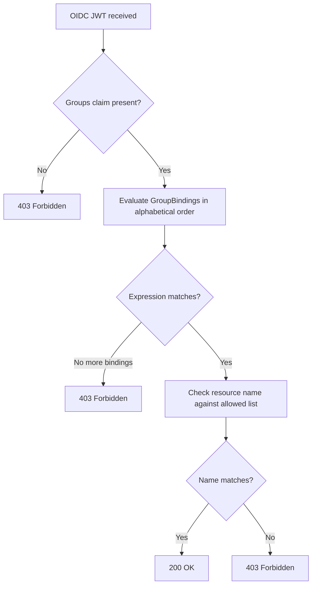

---
tags:
  - guides
  - oidc
  - access-control
  - groupbinding
---

# Fine-Grained Access Control with GroupBinding

`GroupBinding` is a namespaced CRD that restricts which modules and providers an OIDC-authenticated user may access, based on the groups present in their JWT. It requires [OIDC authentication](../configuration/oidc.md) to be enabled.

## How It Works

When a user authenticates via OIDC, the server extracts the configured groups claim from their JWT and evaluates all `GroupBinding` resources in the server namespace in alphabetical order by name. The first `GroupBinding` whose `expression` evaluates to `true` for the user's groups is applied. If an expression fails to compile or evaluate, the request is denied with `403 Forbidden` rather than skipping to the next binding. The user may then access only the modules whose names match the `moduleResources` glob patterns and the providers whose type names are listed in `providerResources` on that `GroupBinding`.



### First-Match Semantics

Only the first binding (alphabetically by name) whose expression is `true` is applied — later bindings are not evaluated. Use ordered name prefixes (e.g., `01-platform-team`, `02-app-teams`) when evaluation order matters.

### Required Groups Claim

The groups claim is **required** when OIDC is enabled. A valid JWT that does not carry the configured claim is denied with **403 Forbidden** — there is no bypass path. Every OIDC user must have a groups claim in their JWT and match a `GroupBinding` to access any resource.

Ensure your IdP connector in Dex is configured to emit a groups claim. Common connectors that do this by default include Microsoft (Entra ID) and GitHub (when `org` is set). See your IdP's Dex connector documentation for the correct scope or claim configuration.

## GroupBinding Resource

### Example

```yaml
apiVersion: opendepot.defdev.io/v1alpha1
kind: GroupBinding
metadata:
  name: platform-team-binding
  namespace: opendepot-system
spec:
  expression: '"platform-team" in groups'
  moduleResources:
    - "aws-*"
    - "gcp-networking"
  providerResources:
    - "aws"
    - "google"
```

### Spec Fields

| Field | Type | Required | Description |
|-------|------|----------|-------------|
| `expression` | `string` | Yes | An [expr-lang](https://expr-lang.org/) boolean expression evaluated against the user's groups. Must return `true` or `false`. |
| `moduleResources` | `[]string` | No | Glob patterns for module names the group may access. Empty list denies access to all modules. |
| `providerResources` | `[]string` | No | Exact provider type names the group may access, or `["*"]` to allow all providers. Empty list denies access to all providers. |

### Expression Syntax

The `expression` field uses [expr-lang](https://expr-lang.org/) syntax. The evaluation environment exposes one variable:

| Variable | Type | Description |
|----------|------|-------------|
| `groups` | `[]string` | Groups extracted from the user's JWT groups claim. |

**Examples:**

```
"platform-team" in groups
"platform-team" in groups || "platform-readonly" in groups
len(groups) > 0
```

!!! tip "Client credentials identities"
    When `server.oidc.allowClientCredentials` is enabled, the Dex CC client's `id` (e.g. `ci-pipeline`) is exposed as the virtual group `"client:ci-pipeline"`. Use this in expressions to grant machine clients scoped access:
    ```
    "client:ci-pipeline" in groups
    ```
    See [Client Credentials (Machine-to-Machine)](../configuration/oidc.md#client-credentials-machine-to-machine) for full setup details.

!!! warning
    A `GroupBinding` with an unparsable expression fails closed. The server logs a `WARN` entry and denies the request with `403 Forbidden` instead of skipping to the next binding. Check server logs to diagnose expression errors.

### Module Resource Glob Patterns

`moduleResources` uses [`path.Match`](https://pkg.go.dev/path#Match) semantics, supporting the `*` wildcard:

| Pattern | Matches | Does not match |
|---------|---------|----------------|
| `aws-*` | `aws-vpc`, `aws-eks`, `aws-s3-bucket` | `gcp-gke` |
| `terraform-aws-*` | `terraform-aws-eks`, `terraform-aws-vpc` | `terraform-google-gke` |
| `*` | every module name | — |
| `my-module` | exactly `my-module` | `my-module-v2` |

`providerResources` takes exact provider type names (e.g., `aws`, `google`, `azurerm`) or the literal `"*"` to allow all providers. No partial wildcard matching is applied to provider names.

An empty `moduleResources` or `providerResources` list denies access to all resources of that type. To allow access to all modules, use `["*"]`; to allow access to all providers, use `["*"]`.

## Configuring the Groups Claim Name

By default the server reads the `groups` JWT claim. If your IdP uses a non-standard claim name, set `server.oidc.groupsClaim` in your Helm values:

```yaml
server:
  oidc:
    groupsClaim: "cognito:groups"  # default is "groups"
```

This controls the `--oidc-groups-claim` server flag. Common non-standard names:

| IdP | Claim name |
|-----|-----------|
| AWS Cognito | `cognito:groups` |
| Okta (custom) | `roles` |
| Entra ID (via Dex) | `groups` (standard) |
| GitHub (via Dex) | `groups` (standard) |

## Example: Team-Based Access

Two GroupBindings restricting access by team:

**Platform team** — full access to AWS and Google resources:

```yaml
apiVersion: opendepot.defdev.io/v1alpha1
kind: GroupBinding
metadata:
  name: 01-platform-team
  namespace: opendepot-system
spec:
  expression: '"platform" in groups || "platform-readonly" in groups'
  moduleResources:
    - "terraform-aws-*"
    - "terraform-google-gke"
  providerResources:
    - "aws"
    - "google"
```

**App teams** — access to shared modules only:

```yaml
apiVersion: opendepot.defdev.io/v1alpha1
kind: GroupBinding
metadata:
  name: 02-app-teams
  namespace: opendepot-system
spec:
  expression: '"developers" in groups'
  moduleResources:
    - "shared-*"
  providerResources:
    - "aws"
```

Apply both:

```bash
kubectl apply -f groupbindings.yaml
```

!!! note
    GroupBindings must be created in the same namespace as the OpenDepot server (default: `opendepot-system`). The server `ServiceAccount` is granted `get`, `list`, and `watch` on `groupbindings` in that namespace by the Helm chart.

## Access Logging

The server emits structured JSON log entries for every authorization decision. These provide a full audit trail for OIDC access:

| Event | Level | Key Fields |
|-------|-------|-----------|
| JWT verified | `DEBUG` | `subject`, `groups_claim_name`, `groups` |
| GroupBinding matched | `INFO` | `subject`, `groups`, `binding_name`, `expression` |
| No GroupBinding matched | `WARN` | `subject`, `groups` |
| Resource access allowed | `INFO` | `subject`, `binding_name`, `resource_type`, `resource_name`, `namespace` |
| Resource access denied (pattern) | `WARN` | `subject`, `binding_name`, `resource_type`, `resource_name`, `namespace` |
| GroupBinding expression invalid | `WARN` | `binding_name`, `expression`, `error` |

View server logs:

```bash
kubectl logs -n opendepot-system -l app=server --follow
```

## See Also

- [OIDC Authentication (Dex)](../configuration/oidc.md) — enable OIDC before deploying GroupBindings
- [API Reference — GroupBinding](../reference/api.md#groupbinding) — full field reference
- [Kubernetes RBAC](../rbac.md) — cluster-level access control
