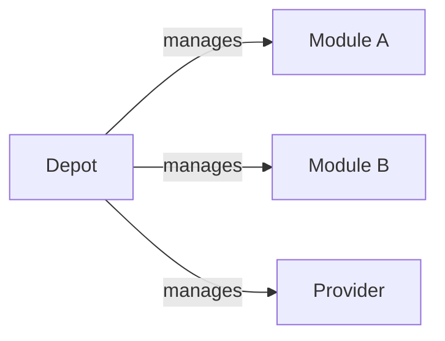

---
tags:
  - guides
  - ui
  - registry-explorer
  - browse
---

# Registry Explorer UI

The Registry Explorer is a browsable, searchable frontend for OpenDepot. Enable it by setting `ui.enabled: true` in the Helm chart.

## Local Quick Start (Kind)

The fastest way to try the UI is with a local [Kind](https://kind.sigs.k8s.io/) cluster using the anonymous-auth mode — no OIDC configuration required.

**Prerequisites**: Docker, Kind, kubectl, Helm, and `make` installed.

```bash
# Build all container images, deploy the UI in anonymous-auth mode,
# and start the port-forward in one step.
make ui-setup
```

Once complete, open **http://opendepot.localtest.me:8080** in your browser.
`opendepot.localtest.me` resolves to `127.0.0.1` via public DNS — no `/etc/hosts` editing needed.

In anonymous-auth mode every visitor sees all resources. This is fine for local exploration but should never be used in production.

### Testing with OIDC login

To test the full OIDC login flow locally (user accounts, GroupBinding visibility rules), run:

```bash
# Build images, generate a TLS cert, deploy Dex + server OIDC + UI OIDC, and start port-forwards.
make ui-setup-oidc PASS=yourpassword
```

This registers two Dex static clients:

| Client | Purpose | Redirect URI |
|--------|---------|--------------|
| `opendepot-ui` | Browser PKCE login | `http://opendepot.localtest.me:8080/auth/callback` |
| `opendepot` | `tofu login` CLI flow | `http://localhost:1000{0-10}/login` |

The default test user is `dev@example.com` / `PASS` and belongs to the group `local-test-group`. Override defaults via Makefile variables:

| Variable | Default | Description |
|----------|---------|-------------|
| `OIDC_EMAIL` | `dev@example.com` | Test user email |
| `OIDC_USER` | `devuser` | Test user display name |
| `OIDC_GROUP` | `local-test-group` | Group name for GroupBinding tests |
| `UI_PORT` | `8080` | Host port for the UI port-forward |
| `OIDC_DEX_PORT` | `5556` | Host port for the Dex port-forward |

Stop all port-forwards when done:

```bash
make ui-stop
```

!!! note "How the OIDC split-URL works"
    The server pod discovers Dex at its in-cluster address (`http://opendepot-dex.opendepot-system.svc.cluster.local:5556/dex`), which is not reachable from your browser. OpenDepot solves this with `ui.oidc.authzUrl`: the UI overrides the `authorization_endpoint` from OIDC discovery with the port-forwarded address (`http://localhost:5556/dex/auth`), so the browser can complete the PKCE redirect while the server still validates tokens using the in-cluster issuer URL.

## Enabling the UI

### 1. Create the session secret

The UI requires an encrypted session cookie secret of at least 32 characters:

```bash
kubectl create secret generic ui-session-secret \
  --from-literal=sessionPassword=$(openssl rand -base64 32) \
  -n opendepot-system
```

### 2. Set Helm values

At minimum:

```yaml
ui:
  enabled: true
  sessionPasswordSecretName: ui-session-secret
  ingress:
    enabled: true
    className: nginx
    hosts:
      - host: opendepot.example.com
        paths:
          - path: /
            pathType: Prefix
    tls:
      - secretName: opendepot-tls
        hosts:
          - opendepot.example.com
```

!!! warning
    When `ui.enabled: true`, the server Ingress is automatically disabled. If you were previously routing through `server.ingress`, migrate to `ui.ingress` before upgrading.

### 3. Apply the chart

```bash
helm upgrade opendepot opendepot/opendepot \
  --namespace opendepot-system \
  -f values.yaml
```

## Public Visibility Labels

By default, the browse endpoints return only resources that have been explicitly marked as public. Two labels control visibility:

| Label | Applied to | Effect |
|-------|-----------|--------|
| `opendepot.defdev.io/public: "true"` | Kubernetes Namespace | Marks the namespace as publicly discoverable |
| `opendepot.defdev.io/public: "true"` | `Module` or `Provider` resource | Marks the individual resource as publicly viewable |

**Both** labels must be present for unauthenticated callers to see a resource. Labelling only the namespace or only the resource is not sufficient.

### Label a namespace

```bash
kubectl label namespace opendepot-system opendepot.defdev.io/public=true
```

### Label a Module resource

```yaml
apiVersion: opendepot.defdev.io/v1alpha1
kind: Module
metadata:
  name: terraform-aws-vpc
  namespace: opendepot-system
  labels:
    opendepot.defdev.io/public: "true"
spec:
  # ...
```

### Label a Provider resource

```yaml
apiVersion: opendepot.defdev.io/v1alpha1
kind: Provider
metadata:
  name: aws
  namespace: opendepot-system
  labels:
    opendepot.defdev.io/public: "true"
spec:
  # ...
```

## Browse Visibility Rules

The browse endpoints apply the following visibility logic based on the caller's authentication state:

| Caller | Resources visible |
|--------|------------------|
| Unauthenticated | Public namespace + public resource only |
| OIDC-authenticated, no matching `GroupBinding` | Public namespace + public resource only |
| OIDC-authenticated, matching `GroupBinding` | Public resources ∪ resources allowed by the `GroupBinding` |
| `anonymousAuth: true` mode | All resources (public labels are ignored) |
| Non-OIDC bearer token (SA or kubeconfig) | Public resources only — `GroupBinding` does not apply |

## GroupBinding for Browse Access

`GroupBinding` resources grant OIDC-authenticated users access to resources beyond the public set. The same `GroupBinding` CRD used for registry protocol access also controls browse visibility.

A `GroupBinding` is evaluated using an [expr-lang](https://expr-lang.org/) expression against the OIDC groups claim. The first matching binding (alphabetically by name) defines the resources the user may see.

### Example

```yaml
apiVersion: opendepot.defdev.io/v1alpha1
kind: GroupBinding
metadata:
  name: platform-team-binding
  namespace: opendepot-system
spec:
  expression: '"platform-team" in groups'
  moduleResources:
    - "terraform-aws-*"   # all modules matching this glob
    - "terraform-gcp-vpc"
  providerResources:
    - "aws"
    - "google"
```

To grant a group access to all modules and providers:

```yaml
spec:
  expression: '"my-org-users" in groups'
  moduleResources:
    - "*"
  providerResources:
    - "*"
```

See [GroupBinding Access Control](groupbinding.md) for full expression syntax, client credentials support, and first-match semantics.

## OIDC Login in the UI

To allow users to log in through the browser:

1. Follow the [UI OIDC configuration](../configuration/ui.md#oidc-login) steps to register an OIDC client and create the client secret.
2. Set `ui.oidc.enabled: true` in your Helm values.

After logging in, users can browse all resources allowed by their `GroupBinding` in addition to the publicly-labelled set.

## Version Sync Warnings

Resource cards in the browse grid and the resource detail page header show an amber warning icon when any `Version` CR under a `Module` or `Provider` has a sync problem, even if the parent resource itself is marked as synced. Hovering the icon displays the tooltip **"Some versions are out of sync"**.

A version is considered out of sync when either of the following is true:

- `status.synced: false`
- `status.syncStatus` contains `"failed"` or `"error"` (case-insensitive)

This indicator is independent of the per-resource sync status chip. A resource can show a green sync status alongside the version warning — indicating the resource is healthy but one or more of its version artifacts failed to download or process.

The server computes this flag for grid cards and exposes it as `hasUnsyncedVersions` in the [List Resources](#list-resources) response. The detail page derives the same flag client-side from the version list already present in the [Resource Detail](#resource-detail) response.

## Versions Table

The versions table on module and provider detail pages supports server-side filtering and pagination via the [List Resource Versions](#list-resource-versions) endpoint.

### Filter bar

| Control | Applicable to | Description |
|---------|--------------|-------------|
| Version search | All | Case-insensitive substring match on the version string |
| Sync status | All | Filter to **All**, **Synced**, or **Failed** versions |
| OS | Providers only | Filter by operating system; options populated from the versions in the current resource |
| Arch | Providers only | Filter by CPU architecture; options populated from the versions in the current resource |

A **Clear** button appears when any filter is active and resets all filters at once.

### Pagination

A **Rows per page** selector (10 / 20 / 50 / 100) and page navigation controls appear at the bottom of the table. Changing any filter resets the table to page 1.

While the table is loading, skeleton rows are displayed. When no versions match the active filters, the table shows **"No versions match the current filters."**

## Depots Page

The **Depots** page (`/depots`) renders an interactive relationship graph of all visible `Depot` resources and the `Module` and `Provider` resources each depot manages. It is accessible from the **Depots** entry in the sidebar navigation.



Each node in the graph is clickable and opens a detail panel showing:

| Node type | Details shown |
|-----------|---------------|
| Depot | Storage backend, polling interval, managed resource counts |
| Module | Latest version, sync status, scan severity counts, link to detail page |
| Provider | Sync status, provider namespace |

### Namespace filtering

A namespace selector at the top of the page narrows the graph to a single Kubernetes namespace. This is useful in large deployments with many depots spread across multiple namespaces.

### Visibility

The Depots page applies the same visibility rules as the rest of the Registry Explorer. Unauthenticated visitors see only depots and resources in namespaces labelled `opendepot.defdev.io/public=true`. OIDC-authenticated users with a matching `GroupBinding` additionally see the resources allowed by that binding. In anonymous-auth mode all depots and resources are visible.

The graph is powered by the [`GET /opendepot/ui/v1/depots/graph`](../reference/api.md#depot-relationship-graph) browse endpoint.

## Migration: Enabling the UI on an Existing Deployment

Existing server-only deployments require no changes until you set `ui.enabled: true`. When you are ready to enable the UI:

1. Create the session secret (see [Enabling the UI](#1-create-the-session-secret)).
2. Set `ui.enabled: true` and `ui.sessionPasswordSecretName`.
3. Move your Ingress configuration from `server.ingress` to `ui.ingress` — the server Ingress is suppressed automatically when the UI is enabled.
4. Optionally configure `ui.oidc.*` for authenticated browse.
5. Label namespaces and resources with `opendepot.defdev.io/public=true` for anonymous browse access.

## Browse API

The browse endpoints are used by the Registry Explorer UI and can also be called directly (for integrations or automation). All endpoints are unauthenticated-accessible; optional `Authorization: Bearer <token>` headers extend visibility per the [rules above](#browse-visibility-rules).

### List Namespaces

```
GET /opendepot/ui/v1/namespaces
```

Returns the namespaces visible to the caller.

**Response:**

```json
{
  "items": [
    { "name": "opendepot-system", "public": true }
  ]
}
```

### List Resources

```
GET /opendepot/ui/v1/resources
```

Returns a paginated, filtered list of visible `Module` and `Provider` resources.

**Query Parameters:**

| Parameter | Type | Description |
|-----------|------|-------------|
| `namespace` | string (repeatable) | Filter by one or more namespaces |
| `kind` | string | Filter by resource kind: `module` or `provider` |
| `q` | string | Search string matched against resource name |
| `synced` | bool | Filter to only synced (`true`) or unsynced (`false`) resources |
| `os` | string | Filter providers by operating system (e.g., `linux`) |
| `arch` | string | Filter providers by CPU architecture (e.g., `amd64`) |
| `severity` | string | Filter to resources with scan findings at or above this severity (`CRITICAL`, `HIGH`, `MEDIUM`, `LOW`) |
| `public_only` | bool | When `true`, return only resources with the public label |
| `sort_by` | string | Sort field (e.g., `name`, `latestVersion`) |
| `sort_dir` | string | Sort direction: `asc` or `desc` |
| `page` | int | Page number (1-based) |
| `page_size` | int | Results per page |

**Response:**

```json
{
  "items": [
    {
      "kind": "module",
      "namespace": "opendepot-system",
      "name": "terraform-aws-vpc",
      "latestVersion": "3.19.0",
      "synced": true,
      "provider": "aws",
      "repoUrl": "https://github.com/terraform-aws-modules/terraform-aws-vpc",
      "scanCounts": { "critical": 0, "high": 1, "medium": 2, "low": 0, "unknown": 0 },
      "public": true
    }
  ],
  "totalCount": 1,
  "page": 1,
  "pageSize": 20
}
```

### Resource Detail

```
GET /opendepot/ui/v1/resources/{namespace}/{kind}/{name}
```

Returns full detail for a single resource, including all versions and scan findings.

**Path Parameters:**

| Parameter | Description |
|-----------|-------------|
| `namespace` | Kubernetes namespace of the resource |
| `kind` | `module` or `provider` |
| `name` | Resource name |

**Response:**

```json
{
  "kind": "module",
  "namespace": "opendepot-system",
  "name": "terraform-aws-vpc",
  "latestVersion": "3.19.0",
  "synced": true,
  "public": true,
  "versions": [
    { "version": "3.19.0", "synced": true },
    { "version": "3.18.0", "synced": true }
  ],
  "sourceScanFindings": [
    {
      "vulnerabilityID": "CVE-2024-12345",
      "pkgName": "some-dep",
      "installedVersion": "1.0.0",
      "fixedVersion": "1.0.1",
      "severity": "HIGH",
      "title": "Example vulnerability"
    }
  ]
}
```

### List Resource Versions

```
GET /opendepot/ui/v1/resources/{namespace}/{kind}/{name}/versions
```

Returns a paginated, filtered list of versions for a single resource. Authentication follows the same rules as the other browse endpoints.

**Path Parameters:**

| Parameter | Description |
|-----------|-------------|
| `namespace` | Kubernetes namespace of the resource |
| `kind` | `module` or `provider` |
| `name` | Resource name |

**Query Parameters:**

| Parameter | Type | Default | Description |
|-----------|------|---------|-------------|
| `page` | int | `1` | Page number (1-based) |
| `page_size` | int | `20` | Items per page (max `100`) |
| `q` | string | — | Case-insensitive substring filter on the version string |
| `synced` | string | — | `true` = healthy versions only, `false` = failed or error versions only; omit for all |
| `os` | string | — | Exact OS filter (case-insensitive); providers only |
| `arch` | string | — | Exact architecture filter (case-insensitive); providers only |

**Response:**

```json
{
  "items": [
    {
      "version": "3.19.0",
      "synced": true,
      "scanCounts": { "critical": 0, "high": 1, "medium": 2, "low": 0, "unknown": 0 }
    }
  ],
  "totalCount": 42,
  "page": 1,
  "pageSize": 20,
  "availableOS": ["darwin", "linux", "windows"],
  "availableArch": ["amd64", "arm64"]
}
```

`availableOS` and `availableArch` are populated from the full (pre-filter) version set so filter dropdowns remain populated while a filter is active. Both fields are omitted for modules; they are only present for providers. Versions are sorted newest-first.
