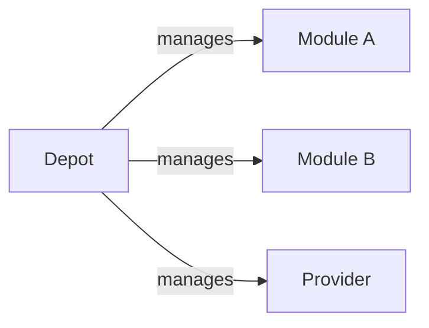

---
tags:
  - guides
  - ui
  - registry-explorer
---

# Browse Resources and Dashboards

Once the Registry Explorer is enabled, use the UI to inspect modules, providers,
versions, scan findings, depots, and download statistics.

## HCL Usage Snippets

Every module and provider detail page shows a **Usage** card with ready-to-paste
HCL blocks and copy-to-clipboard buttons.

For a provider, the card shows OpenTofu and Terraform network mirror settings:

```hcl
provider_installation {
  network_mirror {
    url     = "<mirrorUrl>"
    include = ["<canonicalSource>"]
  }

  direct {
    exclude = ["<canonicalSource>"]
  }
}
```

For a module, the card shows:

```hcl
module "<name>" {
  source  = "<registryHost>/<namespace>/<name>/<provider>"
  version = "<latestVersion>"
}
```

The registry host is derived from `NEXT_PUBLIC_BASE_URL`. See [Consuming
Providers](../providers.md) for the complete provider mirror workflow.

## Module READMEs

When a module README is available, the resource detail page renders it as
markdown with GitHub-flavored tables, task lists, and strikethrough support. Raw
HTML is never executed.

See [Module READMEs](../operations.md#module-readmes) for resolution details.

## Version Sync Warnings

Resource cards show an amber warning when any `Version` under a `Module` or
`Provider` has a sync problem. A version is out of sync when:

- `status.synced: false`
- `status.syncStatus` contains `failed` or `error` (case-insensitive)

The indicator is independent of the parent resource's sync status. The server
exposes the same state as `hasUnsyncedVersions` in the [List Resources](api.md#list-resources)
response.

## Versions Table

Module and provider detail pages support server-side filtering and pagination:

| Control | Applicable to | Description |
|---------|---------------|-------------|
| Version search | All | Case-insensitive substring match |
| Sync status | All | All, Synced, or Failed |
| OS | Providers | Operating system filter |
| Arch | Providers | CPU architecture filter |

Rows per page can be set to 10, 20, 50, or 100. Changing a filter resets the
table to page 1.

## Scan Findings

The **Scan Findings** section lists source findings for modules and providers,
and binary findings per platform for providers. When multiple versions have scan
results, a version selector appears in the section header.

The refresh button re-fetches findings for the selected version without a full
page reload. Scan counts on resource cards are derived from the latest version.

## Depots Page

The **Depots** page (`/depots`) renders an interactive graph of visible `Depot`
resources and the `Module` and `Provider` resources each depot manages.



Each node opens a detail panel showing storage, polling, versions, sync status,
and scan severity counts. A namespace selector narrows the graph to one
Kubernetes namespace.

The graph uses the [`GET /opendepot/ui/v1/depots/graph`](../../reference/api.md#depot-relationship-graph)
browse endpoint and applies the same visibility rules as the rest of the UI.

## Stats Dashboard

The **Stats** page (`/stats`) shows:

| Section | Description |
|---------|-------------|
| Summary cards | Modules, providers, versions, storage, and downloads |
| Sync health | Synced, unsynced, and failed version ratio |
| Security posture | Finding counts by severity |
| Storage distribution | Version counts by backend |
| Most downloaded | Top resources with download totals and timestamps |

Summary counts are computed from Kubernetes CRDs. Download counts come from the
bundled Valkey stats store and remain active across page loads.

!!! note "Visibility"
    Stats use the same visibility rules as the Registry Explorer. OIDC users
    with a matching `GroupBinding` see the resources allowed by that binding.

## Download Tracking

Download events are recorded in the bundled Valkey instance. Before installation,
create the ACL Secret:

```bash
kubectl create secret generic opendepot-valkey-auth \
  --from-literal=default="$(openssl rand -base64 32)" \
  --namespace opendepot-system
```

For local development without a StorageClass, disable persistence:

```yaml
valkey:
  dataStorage:
    enabled: false
```

For production, keep `valkey.dataStorage.enabled: true`. See the [Valkey Stats
Store](../../helm-chart.md#valkey-stats-store) Helm values reference.