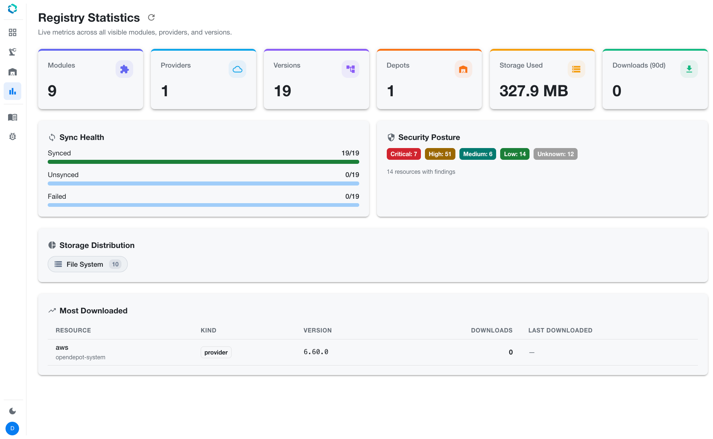

---
tags:
  - guides
  - ui
  - registry-explorer
---

# Stats

Stats provides an operational view of synchronization health, security posture,
storage, and resource usage across the OpenDepot Workshop resources visible to
you.

## Dashboard

The dashboard (`/stats`) shows:

| Section | Description |
|---------|-------------|
| Summary cards | Modules, providers, versions, storage, and downloads |
| Sync health | Synced, unsynced, and failed version ratio |
| Security posture | Finding counts by severity |
| Storage distribution | Version counts by backend |
| Most downloaded | Top resources with download totals and timestamps |

Summary counts are computed from Kubernetes CRDs. Download counts come from
Prometheus over the configured lookback window and remain available across page
loads when the metrics endpoint is being scraped.

!!! note "Visibility"
    The dashboard uses the same visibility rules as OpenDepot Workshop. OIDC
    users with a matching `GroupBinding` see the resources allowed by that
    binding.

## Download Tracking

Download events are exposed as Prometheus metrics from the Server's `/metrics`
endpoint. Configure the chart's `ServiceMonitor` or an equivalent scrape
configuration, and configure `server.stats.prometheusURL` when the dashboard
must query an existing Prometheus deployment.