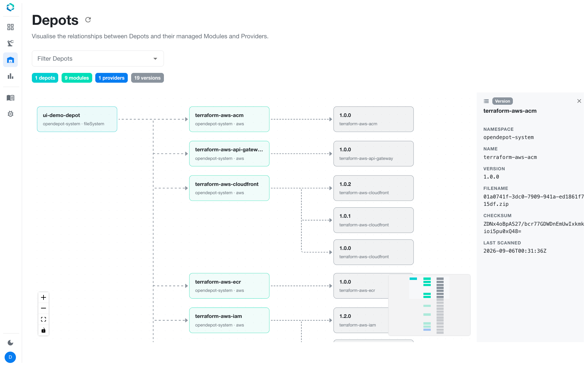
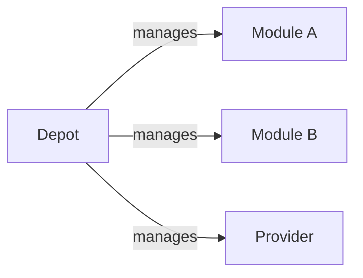

---
tags:
  - guides
  - ui
  - registry-explorer
  - depots
---

# Depots

The **Depots** page (`/depots`) renders an interactive graph of visible `Depot`
resources and the `Module` and `Provider` resources each depot manages.

Each node opens a detail panel showing storage, polling, versions, sync status,
and scan severity counts. A namespace selector narrows the graph to one
Kubernetes namespace.

The graph uses the [`GET /opendepot/ui/v1/depots/graph`](../../reference/api.md#depot-relationship-graph)
browse endpoint and applies the same visibility rules as the rest of the UI.
