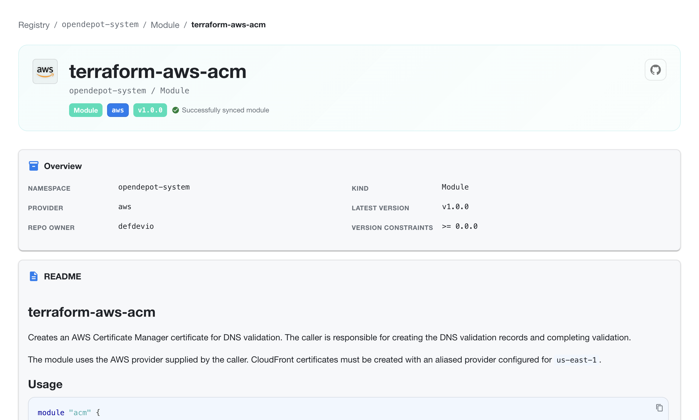
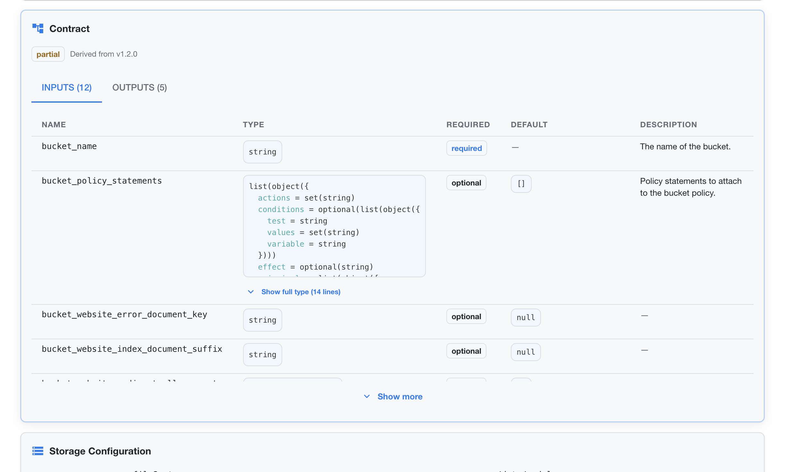
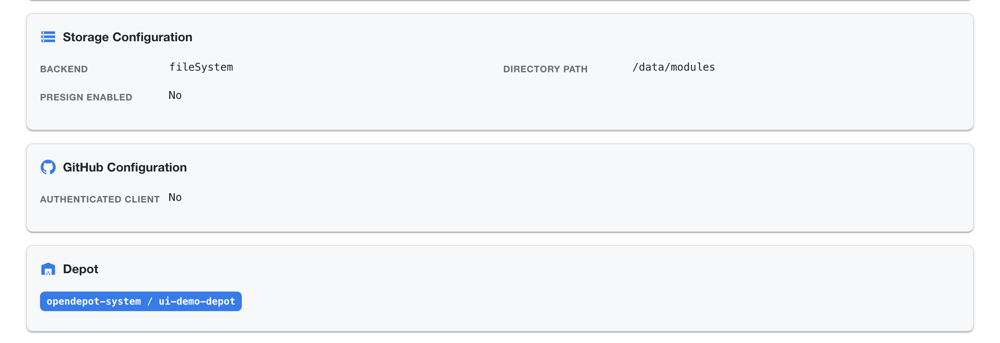
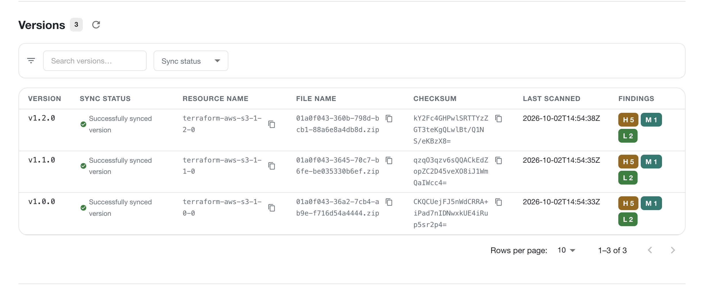
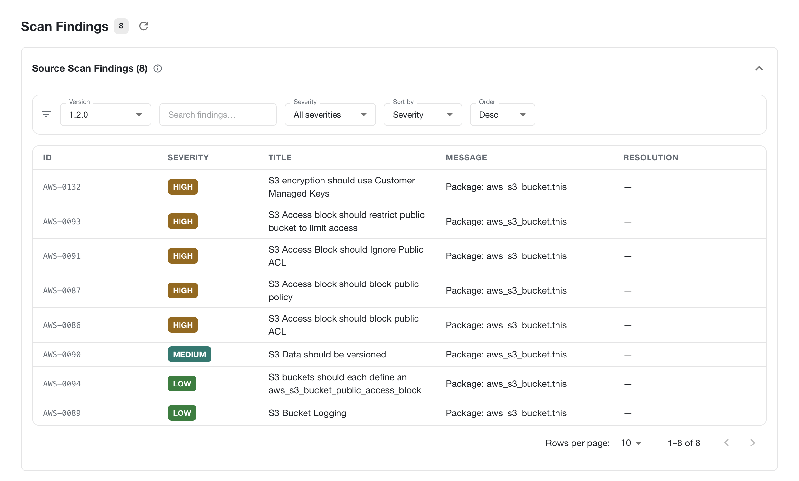

---
tags:
  - guides
  - ui
  - registry-explorer
  - module
---

# Module Details

The Module Details page gives you a focused view of one module in OpenDepot Workshop. Open it from the module list to inspect the module's current version, provider, README, usage example, inputs, outputs, contract, storage metadata, and available versions.

## Module identity and status

The header shows the module name and its Kubernetes location, for example `opendepot-system / Module`. It also displays:

- the module's provider namespace
- the latest synchronized version
- the current synchronization status
- a link to the module's upstream source when one is available

The **Overview** section summarizes the module's namespace, kind, provider, repository owner, latest version, and version constraints.

## README and usage

When a module README is available, Workshop renders it directly on the details page. The README can explain the module's purpose, provider requirements, regional considerations, and other usage guidance maintained by the module publisher.

The **Usage** section includes a ready-to-copy module block with the OpenDepot source address and the module's version constraint. Use this block as a starting point when consuming the module from OpenTofu or Terraform.

## Module contract

The **Contract** section presents the normalized module interface used by Workshop. It shows the module requirement, the source version from which the contract was derived, and a structured table of inputs and outputs with their types, required status, defaults, and descriptions.

This section is useful when comparing the module's published README with the interface extracted from its source archive.

Use **Show more** to expand additional inputs or outputs. Contracts appear only when Assembly Line is enabled and the module version has a successfully derived contract.

!!! note
    Enable Assembly Line with `assembly.enabled: true` in the Helm values. The UI must also be enabled with `ui.enabled: true`. See [Assembly Line Configuration](../../configuration/assembly-line.md).

## Storage, GitHub, and Depot settings

The details page shows the configuration that controls where the module is stored, how its source metadata is retrieved, and which Depot manages it.

### Storage Configuration

Storage Configuration identifies the backend serving the module archive and the directory used by that backend. **Presign enabled** indicates whether downloads use storage-native pre-signed redirects instead of being streamed through the server.

### GitHub Configuration

GitHub Configuration shows whether an authenticated GitHub client was used for source metadata and archive-related operations. An authenticated client can provide access to private or rate-limited GitHub resources when configured by the deployment administrator.

### Depot

The Depot identifies the resource that discovered and manages the module. Select the Depot link to inspect its polling, storage, and managed-resource configuration.

## Versions

The **Versions** view lists synchronized module archives with their sync status, resource name, filename, checksum, scan timestamp, and findings.

Use the search field and sync-status filter to narrow the list. Each row represents one module archive and includes the version, generated resource name, archive filename, checksum, last scan timestamp, and severity counts. Use the pagination controls when a module has more versions than the current page.

A module version can be selected to inspect its version-specific metadata and scan results. The information shown follows the same visibility rules as the rest of Workshop.

## Scan Findings

The **Scan Findings** view shows the security findings associated with a selected module version. Use the version selector, search field, severity filter, sort field, and sort order to focus on the findings that need attention.

Each finding includes its rule ID, severity, title, affected package or resource, message, and recommended resolution. The count in the page header reflects the findings currently associated with the selected version.

## Related views

- [Workshop](index.md)
- [Provider Details](provider-details.md)
- [Browse resources and dashboards](browse.md)
- [Browse API](api.md)
- [Workshop authentication](../../authentication/registry-explorer.md)
