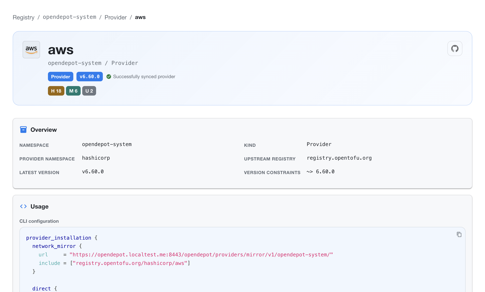
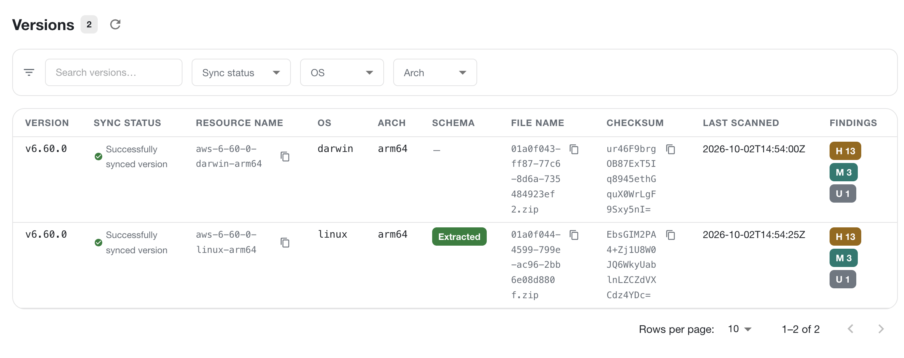
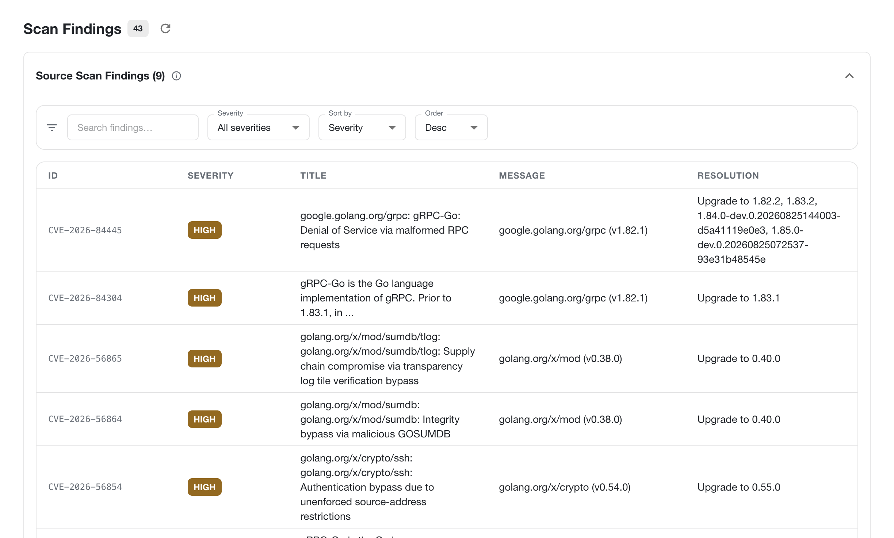

---
tags:
  - guides
  - ui
  - registry-explorer
  - provider
---

# Provider Details

The Provider Details page gives you a focused view of one provider in OpenDepot Workshop. Open it from the provider list to inspect the provider's current version, registry identity, synchronization state, usage configuration, and available versions.

## Provider identity and status

The header shows the provider name and its Kubernetes location, for example `opendepot-system / Provider`. It also displays:

- the resource kind and latest version
- the upstream registry used for discovery and downloads
- the current synchronization status
- vulnerability and scan counts for the provider
- a link to the provider's upstream source when one is available

Use the status message and health counts to quickly determine whether the provider is ready to consume or needs attention.

## Overview

The **Overview** section shows the metadata that identifies the provider:

| Field | Description |
|-------|-------------|
| Namespace | Kubernetes namespace containing the provider resource |
| Kind | Resource kind, typically `Provider` |
| Provider namespace | Namespace used by the provider registry, such as `hashicorp` |
| Upstream registry | Canonical registry used for provider discovery and downloads |
| Latest version | Most recent synchronized provider version |
| Version constraints | Constraint applied when selecting provider versions |

## Usage

The **Usage** section provides copyable configuration for consuming the provider through the OpenDepot network mirror. The generated configuration includes the mirror URL and the provider address to include.

Copy the configuration into the appropriate OpenTofu or Terraform CLI configuration file when configuring a network mirror. The exact URL is specific to the OpenDepot deployment and namespace shown on the page.

## Versions and findings

The **Versions** view lists each synchronized provider artifact by platform. Use the search field and filters to narrow the list by version, synchronization status, operating system, or architecture.

Each row includes the artifact's version, synchronization status, resource name, operating system, architecture, schema extraction state, archive filename, checksum, last scan time, and finding counts. A provider version can appear in multiple rows when OpenDepot has artifacts for multiple operating systems or architectures.

The findings badges summarize the number of high, medium, and unknown-severity findings for that artifact. Select a version row to inspect its detailed scan results.

## Scan findings

The **Scan Findings** view collects the provider's source and binary findings in one searchable table.

Use the search field, severity filter, and sort controls to focus on the findings that need attention. Each finding includes its identifier, severity, title, affected package and version, message, and recommended resolution. The count in the page header shows the total findings currently associated with the provider.

The information shown follows the same visibility rules as the rest of Workshop. A provider or version is visible only when the current authentication mode and any applicable `GroupBinding` rules allow access.

## Related views

- [Workshop](index.md)
- [Browse resources and dashboards](browse.md)
- [Browse API](api.md)
- [Workshop authentication](../../authentication/registry-explorer.md)
