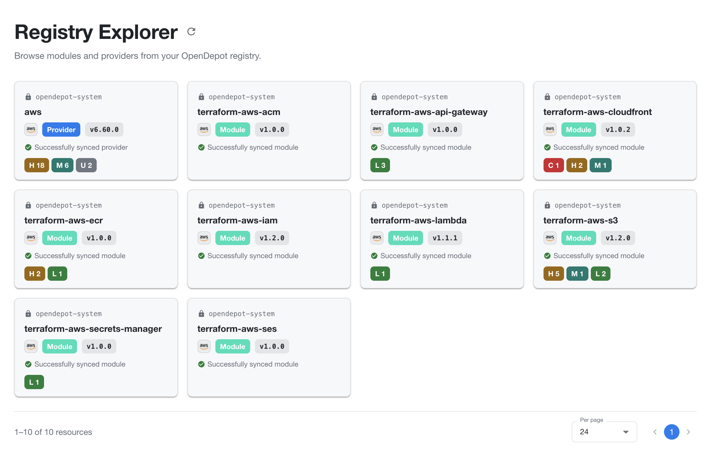

---
tags:
  - guides
  - ui
  - registry-explorer
  - browse
---

# Registry Explorer

The Registry Explorer is OpenDepot Workshop's discovery surface. It gives users
an overview of the modules and providers available to them and lets them open
resource details, versions, and security information.

## Reading the Registry Explorer

Each resource card summarizes the latest available version:

| Card attribute | Meaning |
| --- | --- |
| Namespace | The Kubernetes namespace that owns the resource. |
| Resource name | The name used to identify the module or provider. Select the card to open its details. |
| Provider icon | The provider ecosystem associated with the resource, such as AWS. |
| Type | Whether the resource is a `Module` or `Provider`. |
| Version | The latest version currently shown for the resource. |
| Sync status | Whether the resource version was successfully synchronized or needs attention. |
| Finding badges | The number of scan findings by severity: `C` critical, `H` high, `M` medium, `L` low, and `U` unknown. |

The footer shows how many resources are displayed, the selected page size, and
pagination controls. Change the page size or move between pages to browse the
full set of resources visible to you.

## What users see

Depending on their authentication and visibility permissions, users can expect
to find:

- **Modules** with versions, README content, usage examples, contracts, inputs,
  outputs, and scan findings.
- **Providers** with versions, platform artifacts, checksums, extracted schemas,
  and source or binary scan findings.

The Registry Explorer shows the resources the current user can access. If a
resource is not visible, check the current authentication mode, public labels,
and any applicable `GroupBinding`.

## Related Guides

- [OpenDepot Workshop](index.md)
- [Module Details](module-details.md)
- [Provider Details](provider-details.md)
- [OpenDepot Workshop Administration](administration.md)
- [OpenDepot Workshop authentication](../../authentication/registry-explorer.md)
