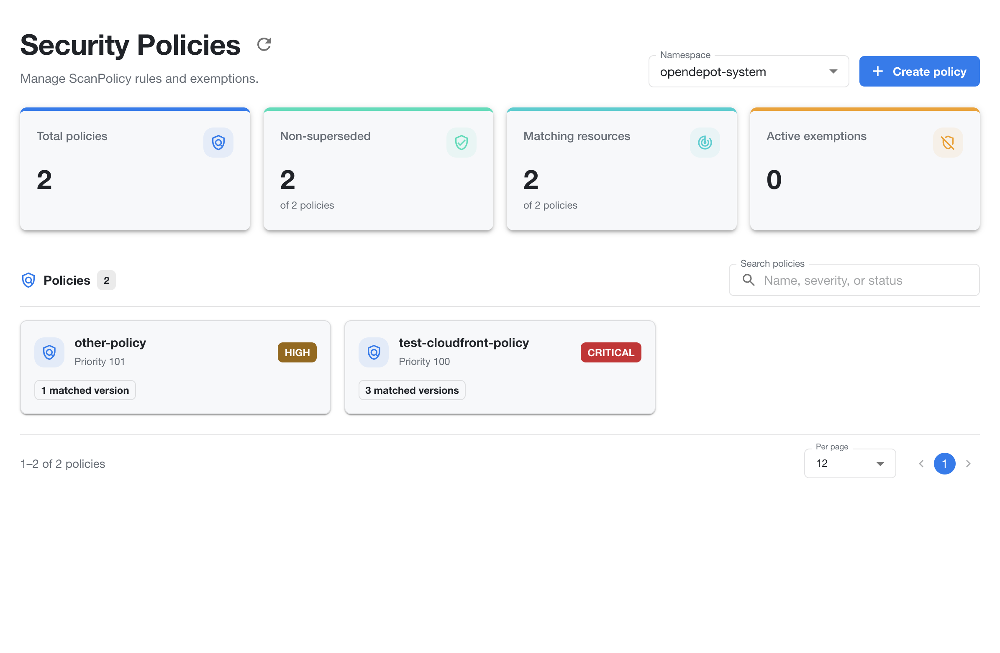
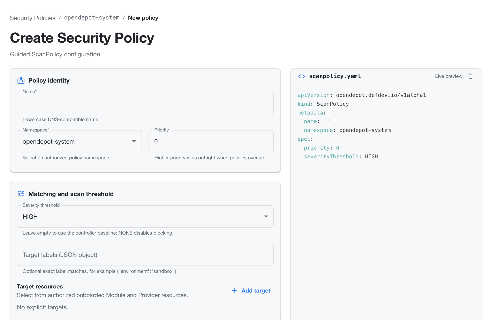
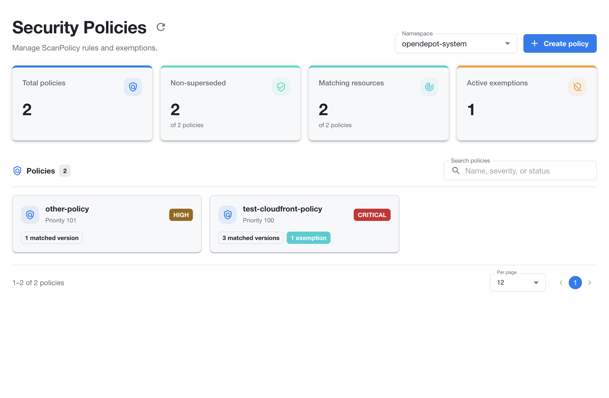
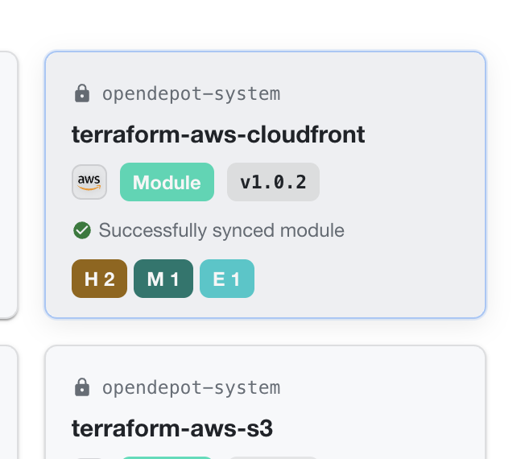
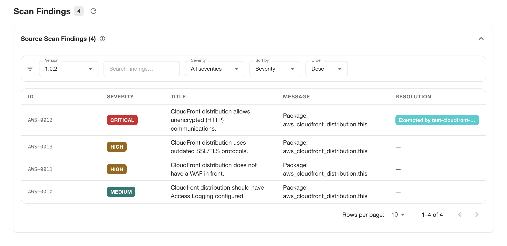
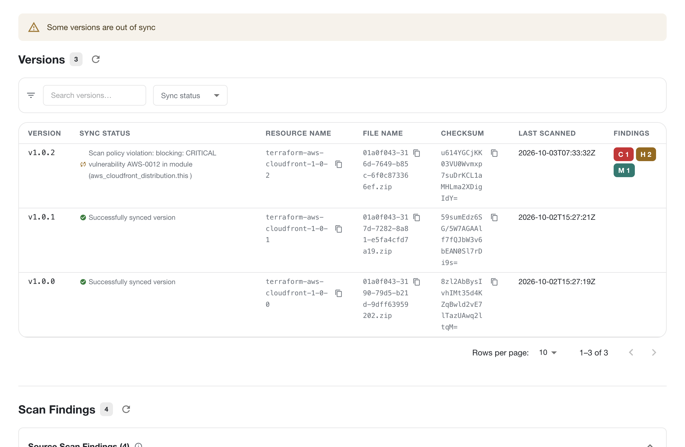
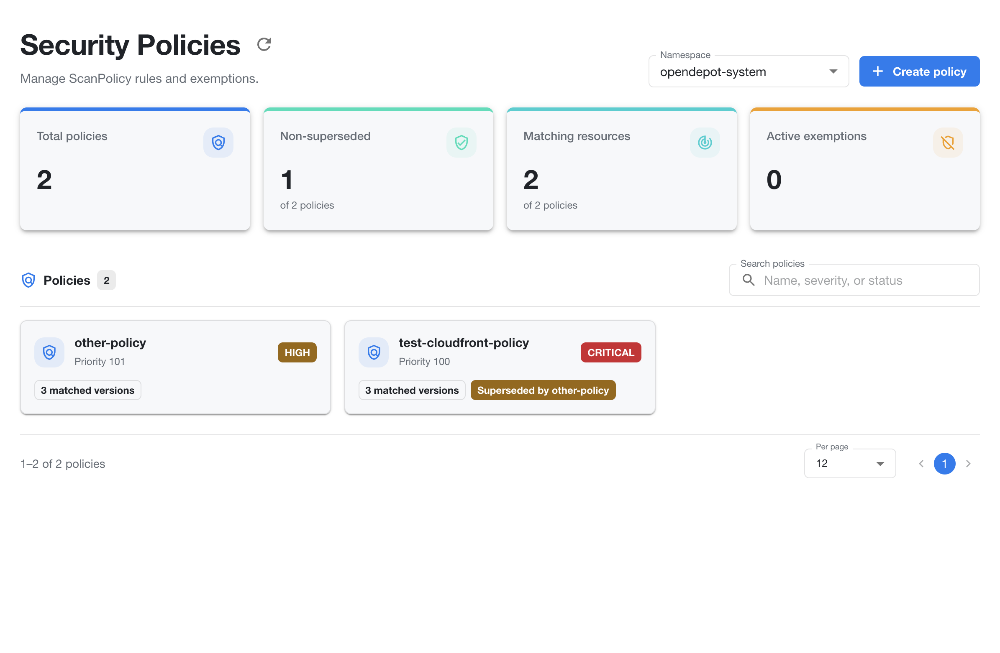

---
tags:
  - guides
  - ui
  - registry-explorer
  - security-policies
---

# Security Policies

OpenDepot Workshop provides a Security Policies view for managing `ScanPolicy`
rules and exemptions. Open it at `/security-policies` to review the policies
that apply to resources in a selected namespace.



!!! warning "Keep policies in source control"
    Creating policies in OpenDepot Workshop is provided for convenience, such
    as when you need to react to a threat immediately. Always copy the generated
    YAML and commit it to source control. OpenDepot Workshop assumes a GitOps
    workflow, where Git is the audit trail; OpenDepot does not retain this
    policy history today.

## Policy overview

The page includes summary cards for:

- **Total policies** — all policies in the selected namespace.
- **Non-superseded** — policies that are currently active in policy evaluation.
- **Matching resources** — resources matched by the policies.
- **Active exemptions** — current exemptions from policy findings.

The policy list shows each policy's name, priority, severity threshold, and
number of matched versions. Select a policy to inspect its rules, matches, and
exemptions.

## Find and create policies

Use the namespace selector to change the scope of the policy list. Use **Search
policies** to filter by policy name, severity, or status.

Select **Create policy** to define a new `ScanPolicy` in the selected namespace.

## Create a policy

The guided form creates a namespaced `ScanPolicy` and updates a live YAML
preview as you work.



### Define policy identity

Enter a lowercase DNS-compatible **Name**, select an authorized **Namespace**,
and optionally set a numeric **Priority**. When policies overlap, the policy
with the higher priority wins outright.

### Set matching and scan behavior

Choose a **Severity threshold** to control which findings block matching
resources. Leave the value empty to use the controller baseline, or choose
`NONE` to disable blocking for the policy.

Use **Target labels** to restrict matching to resources with exact label pairs.
Enter the labels as a JSON object, for example:

```json
{"environment":"sandbox"}
```

You can also add explicit **Target resources**. The form lets you select from
authorized onboarded Module and Provider resources. When no explicit targets
are configured, the policy relies on its other matching criteria.

### Add finding exemptions

Use **Add exemption** to exempt a finding from the policy. Every exemption must
include a reason. Leave its expiry empty for an indefinite exemption.

Each exemption can be narrowed with these fields:

- **Vulnerability IDs** — enter one or more vulnerability identifiers, such as
  `CVE-2026-0001` or `aws-0057`. Use `*` to match any vulnerability ID.
- **Package names** — enter one or more package names, such as `stdlib` or
  `golang.org/x/net`. Use `*` to match any package.
- **Severities** — select the finding severity or leave the filter at `All`.
- **Scan types** — select the scan type or leave the filter at `All`.
- **Reason** — required documentation for why the finding is exempted.
- **Expires** — optional date after which the exemption no longer applies.

Use the trash button to remove an exemption before saving. The live YAML preview
adds each configured exemption under `spec.exemptions`.

### Validate and create

Review the generated `scanpolicy.yaml` in the live preview. Use the copy button
to copy the manifest, **Validate policy** to check the configuration, or
**Create policy** to submit it. Use **Cancel** to return to the policy list
without creating a resource.

## Review active exemptions

After you create a policy with an exemption, the Security Policies page shows
the active exemption in the summary card and on the policy card. The exemption
count is separate from matched-version counts. Open the policy to review the
finding filters, reason, and expiry date.



OpenDepot Workshop also reflects active exemptions on affected resource cards.
The card keeps its normal sync status and finding-severity badges, and adds an
`E` badge for exempted findings. For example, `H 2`, `M 1`, and `E 1` indicate
two high-severity findings, one medium-severity finding, and one exempted
finding.



On a module's **Scan Findings** section, an exempted finding remains in the
findings table with its original severity. Its **Resolution** column displays
an `Exempted by <policy-name>` badge, while findings without exemptions keep the
normal unresolved marker.



The findings count still includes the displayed finding. Use the version
selector, search, severity filter, and sorting controls to inspect the findings
for a specific module version.

## Blocked versions

After you create a policy with a blocking threshold, a blocked version appears
in the module's **Versions** section with a warning that some versions are out
of sync. The affected version's sync status reports the policy violation,
including the blocking severity, vulnerability ID, and resource location.



The blocked version remains listed with its findings badges, while unaffected
versions can continue to show **Successfully synced version**. This differs
from an exemption: an exempted finding is marked in the Scan Findings
**Resolution** column, whereas a blocked version reports the policy violation
in its **Sync Status** column.

## Superseded policies

When policies overlap, the higher-priority policy wins outright. The lower-
priority policy remains visible in the list, but it is marked **Superseded by
`<policy-name>`** so users can see which policy takes precedence.



The summary separates **Total policies** from **Non-superseded** policies. In
the example above, two policies exist but only one is non-superseded. A
superseded policy can still be opened to review its configuration and matching
resources; its status explains why it is not the effective policy when the
rules overlap.
