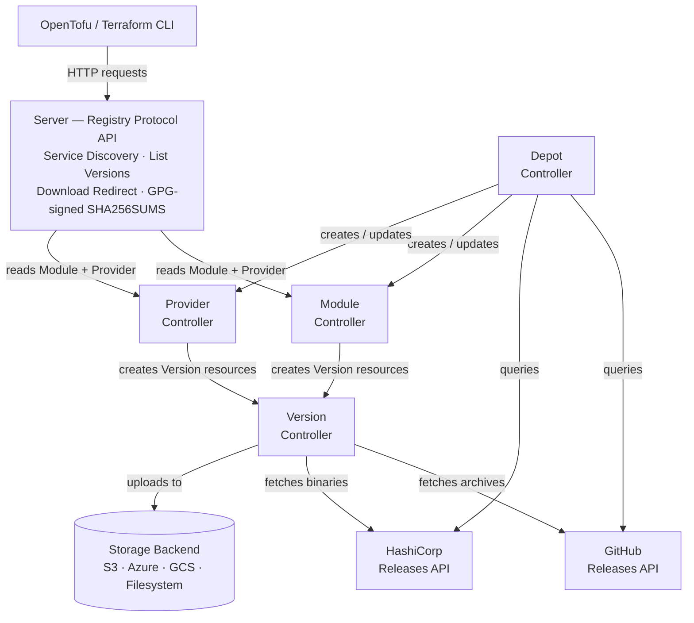

## Why OpenDepot?

Enterprise registries like JFrog Artifactory and HCP Terraform charge for features that should come standard — vulnerability scanning, automatic version discovery, and secure auth. They also bring heavyweight operational baggage: external databases, proprietary identity stores, and infrastructure your team has to maintain.

OpenDepot is **free, open source, and Kubernetes-native**. It ships all of those features out of the box, delegates auth entirely to Kubernetes RBAC, and requires nothing beyond a Helm chart and a storage backend.

- :material-shield-check: &nbsp;__Security First__

    ---

    Kubernetes bearer tokens and RBAC — no proprietary tokens, no user database, no extra identity store. Works with IRSA, Workload Identity, and any OIDC provider out of the box.

- :material-refresh: &nbsp;__Self-Healing__

    ---

    Declarative controllers continuously reconcile toward desired state. Transient errors retry with exponential backoff. Applying the same manifest twice is a no-op.

- :material-database-off: &nbsp;__No Database Required__

    ---

    The Kubernetes API is the datastore. No PostgreSQL, no Redis, no external dependencies — just a Helm chart and a storage backend.

- :material-cloud-check: &nbsp;__Multi-Cloud Storage__

    ---

    S3, Azure Blob, Google Cloud Storage, and local filesystem — all supported out of the box with SDK-native authentication chains.

- :material-tag-check: &nbsp;__Automatic Version Discovery__

    ---

    The Depot controller queries the GitHub Releases API for modules and the HashiCorp Releases API for providers, resolves your version constraints, and creates resources automatically.

- :material-lock-check: &nbsp;__Tamper-Resistant Checksums__

    ---

    Checksums are written to Kubernetes status subresources (protected by RBAC) and verified on every reconciliation — not just at upload time.

- :material-magnify-scan: &nbsp;__Built-In Vulnerability Scanning__

    ---

    The Version controller runs [Trivy](https://trivy.dev/) automatically on every provider binary, provider source (`go.mod`), and module archive. Findings are stored on the Kubernetes resource and can optionally block promotion of critical or high severity artifacts.

- :material-link-variant: &nbsp;__Zero-Egress Provider Downloads__

    ---

    Enable pre-signed URL redirects so OpenTofu fetches provider binaries directly from S3, GCS, or Azure Blob — no bandwidth through the server, no extra hops, no infrastructure bottleneck.

## How OpenDepot Compares

| Feature                  | OpenDepot (OSS)         | HCP Terraform Registry      | JFrog Artifactory         | GitLab Terraform Registry | Harbor / OCI Registry      | Terrarium / Tapir / Hermit (OSS) |
|--------------------------|-------------------------|----------------------------|---------------------------|--------------------------|----------------------------|-----------------------------------|
| **License**              | Apache 2.0 (Free, OSS)  | Commercial SaaS/Enterprise | Commercial (Paid)         | GitLab EE/CE (Mixed)     | Apache 2.0 (OSS)           | OSS (varies)                      |
| **Auth**                 | Kubernetes RBAC         | HCP tokens, SSO            | Artifactory tokens, SSO   | GitLab users             | Registry users/OIDC         | API keys, basic auth              |
| **Database Required**    | No (K8s API)            | SaaS-managed/PostgreSQL    | Yes (external DB)         | Yes                      | Yes                         | Yes                               |
| **Deployment**           | Helm chart, K8s-native  | SaaS / Enterprise on-prem  | Docker/K8s/VM             | SaaS or self-hosted      | Docker/K8s                  | Docker/K8s                        |
| **Self-healing**         | Yes (controller loop)   | Partial (SaaS-managed)     | No                        | No                       | No                          | No                                |
| **Multi-cloud Storage**  | S3, Azure, GCS, FS      | SaaS-managed               | S3, Azure, GCS            | S3, GCS, Filesystem      | S3, GCS, Azure, Filesystem  | S3, GCS, Filesystem               |
| **Version Discovery**    | Automatic (GitHub/HC)   | VCS-connected/manual       | Manual upload/API         | Manual/CI                | Manual/CI                   | Manual upload                     |
| **Immutability**         | Checksum every reconcile| At upload only             | Repo-level flag           | At upload only           | At upload only              | At upload only                    |
| **Air-gapped Support**   | Yes (FS + PVC)          | Enterprise only            | Yes                       | Yes                      | Yes                         | Yes                               |
| **Vuln Scanning**        | Built-in (Trivy)        | No                         | Paid add-on (Xray)        | No                       | No                          | No                                |
| **Pre-signed URLs**      | Yes (S3, GCS, Azure)    | No                         | Yes (CDN)                 | No                       | No                          | No                                |
| **Provider Support**     | Yes                     | Yes                        | Yes                       | No                       | No                          | No (modules only)                 |
| **Open Source**          | Yes                     | No                         | No                        | Partial                  | Yes                         | Yes                               |

!!! tip
    Enterprise registries charge for features OpenDepot ships for free — automatic version discovery, built-in vulnerability scanning, and Kubernetes-native auth with no external identity store. If you're already running Kubernetes, OpenDepot gives you all of that with no license fees, no extra infrastructure, and no extra attack surface.

## How It Works

See [Architecture](architecture.md) for a detailed description of each controller and the full reconciliation event flow.

## Next Steps

- :material-rocket-launch: &nbsp;[__Install with Helm__](getting-started/installation.md)

    Deploy OpenDepot to your cluster in minutes.

- :material-laptop: &nbsp;[__Local Quickstart__](getting-started/quickstart.md)

    Run a fully functional registry locally with `kind` — no cloud account needed.

- :material-sitemap: &nbsp;[__Architecture__](architecture.md)

    Understand how the four services interact and reconcile.

- :material-book-open-variant: &nbsp;[__Guides__](guides/index.md)

    GitOps, CI/CD, Depot, provider consumption, and migration workflows.

