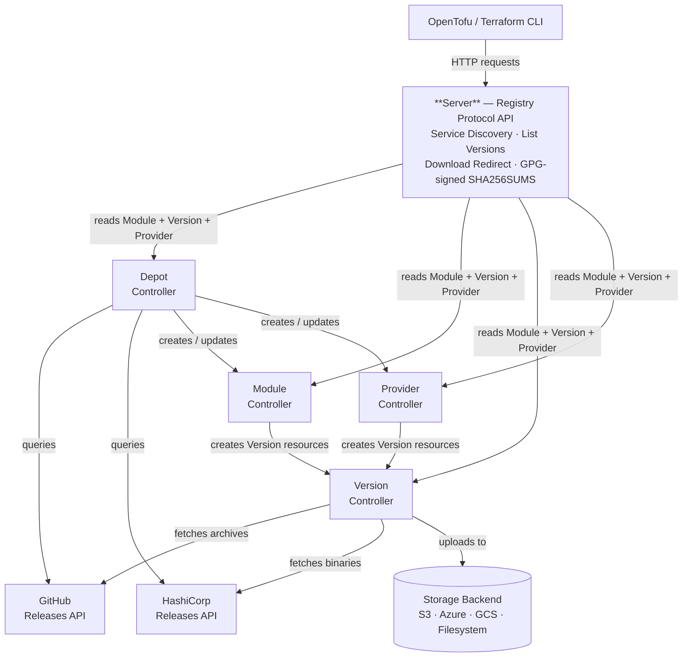

## Why OpenDepot?

There are several open-source Terraform/OpenTofu module registries. They're good projects, but they all share a common challenge: **authentication and authorization are bolted on**. Most require a separate database, API keys or OAuth flows, and user accounts outside your infrastructure platform.

OpenDepot delegates auth entirely to Kubernetes — the platform you're likely already running.

- :material-shield-check: &nbsp;__Security First__

    ---

    Kubernetes bearer tokens and RBAC — no proprietary tokens, no user database, no extra identity store. Works with IRSA, Workload Identity, and any OIDC provider out of the box.

- :material-refresh: &nbsp;__Self-Healing__

    ---

    Declarative controllers continuously reconcile toward desired state. Transient errors retry with exponential backoff. Applying the same manifest twice is a no-op.

- :material-database-off: &nbsp;__No Database Required__

    ---

    The Kubernetes API is the datastore. No PostgreSQL, no Redis, no external dependencies — just a Helm chart and a storage backend.

- :material-cloud-check: &nbsp;__Multi-Cloud Storage__

    ---

    S3, Azure Blob, Google Cloud Storage, and local filesystem — all supported out of the box with SDK-native authentication chains.

- :material-tag-check: &nbsp;__Automatic Version Discovery__

    ---

    The Depot controller queries the GitHub Releases API for modules and the HashiCorp Releases API for providers, resolves your version constraints, and creates resources automatically.

- :material-lock-check: &nbsp;__Tamper-Resistant Checksums__

    ---

    Checksums are written to Kubernetes status subresources (protected by RBAC) and verified on every reconciliation — not just at upload time.

## How OpenDepot Compares

| Feature | OpenDepot | Terrareg | Tapir |
|---------|----------|----------|-------|
| Auth mechanism | Kubernetes RBAC + bearer tokens | API keys + SAML/OpenID Connect | API keys |
| Database required | No (Kubernetes API is the datastore) | Yes (PostgreSQL/MySQL/SQLite) | Yes (MongoDB/PostgreSQL) |
| Deployment model | Helm chart, runs on any Kubernetes cluster | Docker Compose or standalone | Docker Compose or standalone |
| Self-healing | Yes (controller reconciliation loop) | No | No |
| Multi-cloud storage | S3, Azure Blob, GCS, Filesystem | S3, Filesystem | S3, GCS, Filesystem |
| Version discovery | Automatic via Depot (GitHub + HashiCorp Releases APIs) | Manual upload or API push | Manual upload or API push |
| Immutability enforcement | Checksum validated every reconciliation | At upload time only | At upload time only |
| Air-gapped support | Yes (filesystem backend + PVC) | Yes (filesystem) | Limited |

!!! tip
    If you're already running Kubernetes, OpenDepot gives you a registry where security, auth, and operations come free — no extra infrastructure, no extra accounts, no extra attack surface.

## How It Works

See [Architecture](architecture.md) for a detailed description of each controller and the full reconciliation event flow.

## Next Steps

- :material-rocket-launch: &nbsp;[__Install with Helm__](getting-started/installation.md)

    Deploy OpenDepot to your cluster in minutes.

- :material-laptop: &nbsp;[__Local Quickstart__](getting-started/quickstart.md)

    Run a fully functional registry locally with `kind` — no cloud account needed.

- :material-sitemap: &nbsp;[__Architecture__](architecture.md)

    Understand how the four services interact and reconcile.

- :material-book-open-variant: &nbsp;[__Guides__](guides/index.md)

    GitOps, CI/CD, Depot, provider consumption, and migration workflows.

