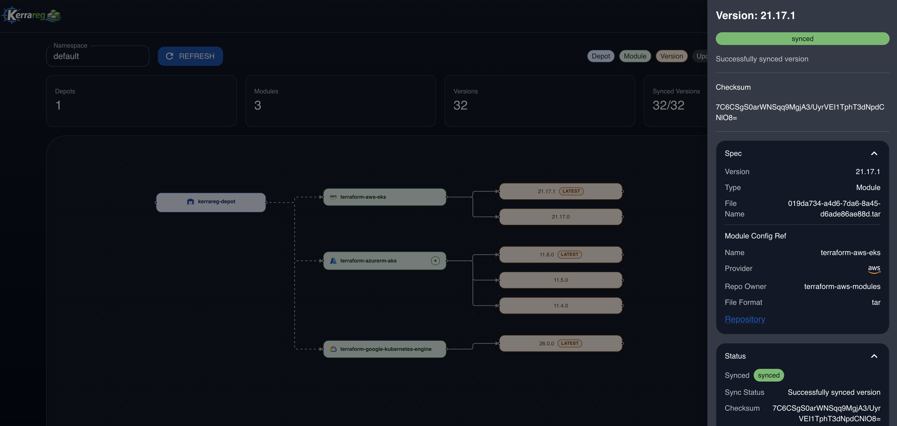
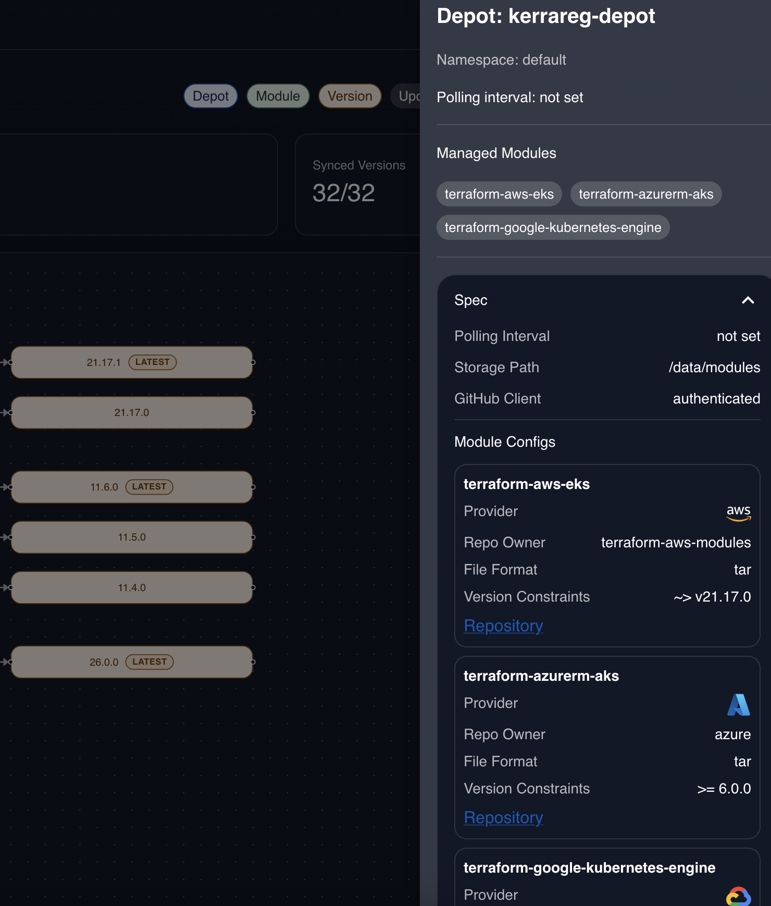
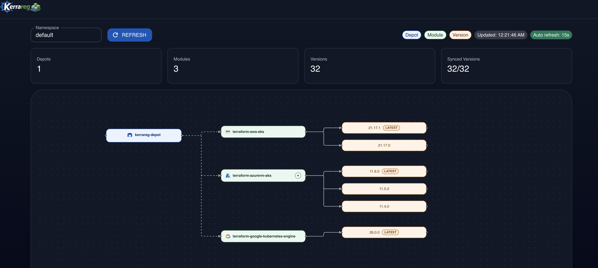

# OpenDepot Internal Developer Portal (Example)

A React + Material UI demo app that visualizes OpenDepot resources as a graph:

- Depot -> Modules -> Versions

The frontend is read-only and calls a small Node API. The Node API uses `@kubernetes/client-node` and supports both:

- local kubeconfig mode (for `kind` development)
- in-cluster ServiceAccount mode (for Kubernetes deployment)

## Quick Start (Local)

1. Install dependencies:

```bash
npm install
```

2. Copy environment template:

```bash
cp .env.example .env
```

3. Start API + UI together:

```bash
npm run dev
```

4. Open the UI:

- http://localhost:5173

## UI Screenshots







## Environment Variables

- `KERRAREG_NAMESPACE`: Namespace to query (default `opendepot-system`)
- `KERRAREG_K8S_AUTH_MODE`: `auto`, `kubeconfig`, or `incluster` (default `auto`)
- `KUBECONFIG`: Optional path when running in local kubeconfig mode
- `PORT`: API server port (default `8082`)
- `VITE_API_BASE_URL`: Optional frontend API base URL (example: `http://localhost:8082`)

## Troubleshooting

If you see browser errors like `:5173/api/graph ... 404 (Not Found)`, usually one of these is true:

- Only the UI is running (`npm run dev:ui`) and the API is not running on `:8082`.
- The API URL is being routed somewhere unexpected.

Use one of these fixes:

- Preferred: run both processes together with `npm run dev`.
- Or run API and UI separately, and set `VITE_API_BASE_URL=http://localhost:8082`.

## API Endpoint

- `GET /api/graph?namespace=<ns>`

Returns a normalized graph payload with:

- `depots[]`
- `modules[]`
- `versions[]`
- `edges[]`
- `summary`

## In-Cluster Deployment (Optional)

Use the manifests in [k8s/rbac-readonly.yaml](k8s/rbac-readonly.yaml) and [k8s/deployment.yaml](k8s/deployment.yaml) as a starting point.

- `rbac-readonly.yaml` grants least-privilege read access (`get/list/watch`) to depots/modules/versions
- `deployment.yaml` shows how to run the app with ServiceAccount auth and expose it as a ClusterIP service

## Notes

- The graph maps Depot -> Module using `Depot.status.modules`.
- The graph maps Module -> Version using label `opendepot.defdev.io/module`.
- This is a demo portal intended for Internal Developer Portal integration examples.
